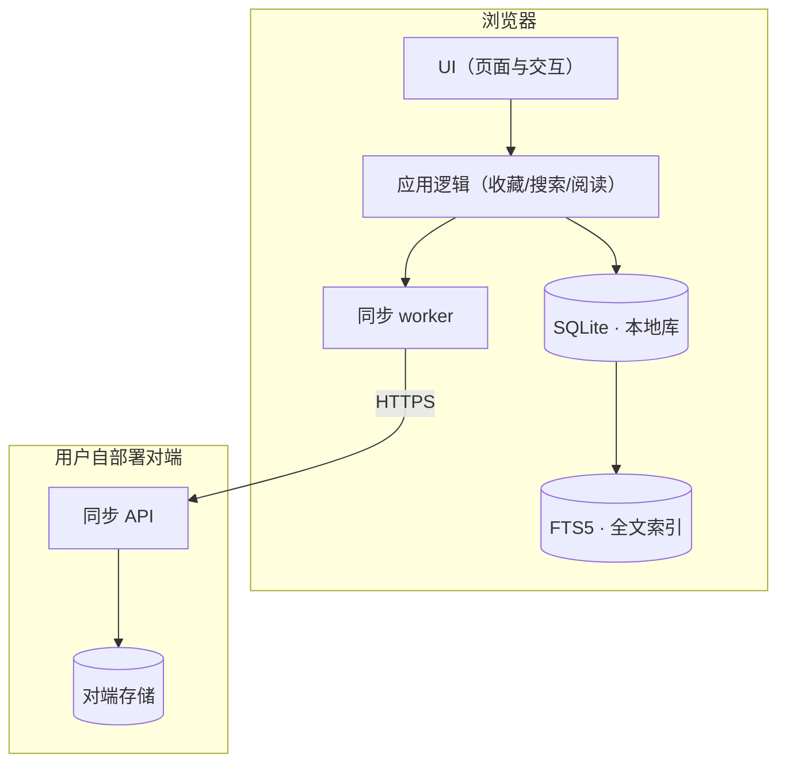
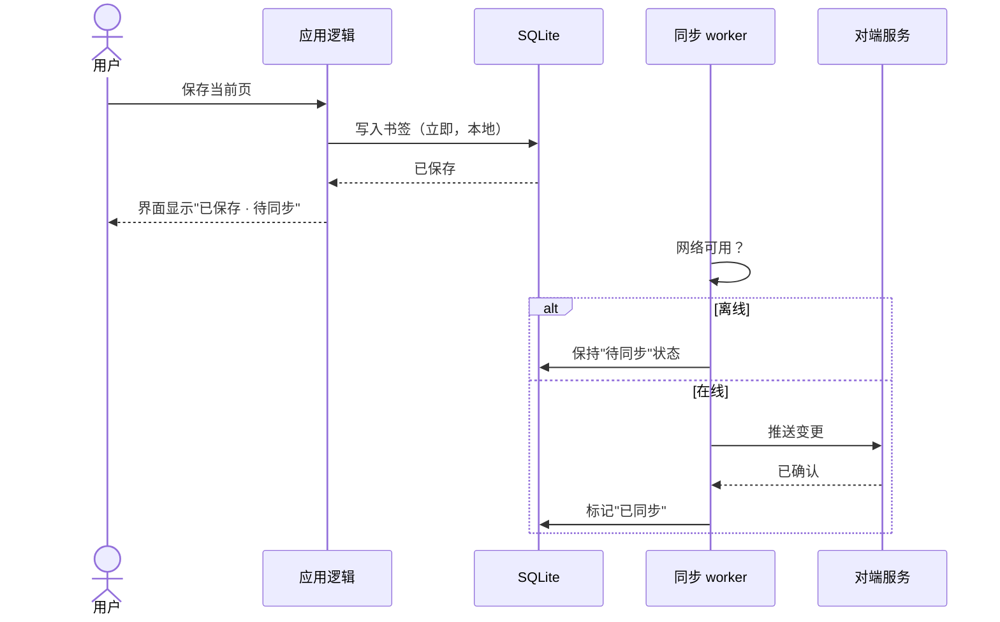
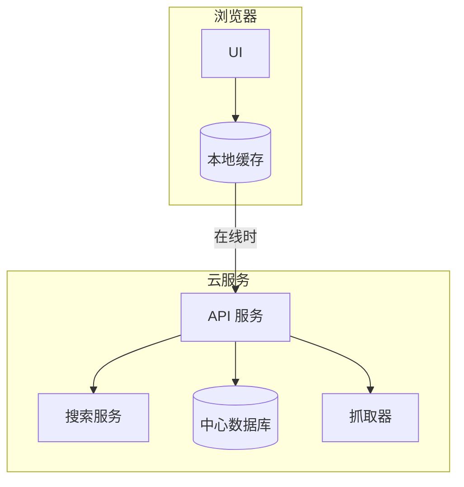

# Reading List — Architecture Candidates

Behavior-first order: the scenarios were approved first, so decision points are
derived FROM them (full-text search, offline reads, background sync).

## Decision points forced by the requirements

| # | Decision | Forced by |
|---|---|---|
| 1 | Local storage engine | offline reads + 250MB ceiling + full-text search |
| 2 | Full-text index | "find by any word in the article" |
| 3 | Sync transport | two devices, one user, no third-party clients |
| 4 | Snapshot fetcher | full-text capture of saved pages |

## Candidate A — local-first SQLite monolith

Single web app; SQLite (WASM) in the browser; background sync worker talks to a
user-run peer over HTTPS.



Critical flow (leading candidate): save-then-sync, including the offline branch.



## Candidate B — cloud-API app with local cache

Thin client; a hosted API owns storage and search; cache layer for offline.



## Compatibility analysis

Verified with `clarity versions sql.js sqlite-fts5-better-sqlite3 …` at design time
(see ADR for the checked versions/dates — never trust memory for versions).

| Point | A · local SQLite | B · cloud API |
|---|---|---|
| Offline reads | native (storage IS the app) | cache discipline — partial, easy to get subtly wrong |
| Full-text search | FTS5 in-browser, proven | server-side, trivial |
| 250MB ceiling | browser storage quota risk (eviction!) | server, no quota |
| Sync complexity | last-write-wins on a single user's two devices — small | central authority — none |
| Privacy (paywalled snapshots) | stays on user devices | crosses to a host — needs trust/config |
| Deployment | user runs a tiny peer (or none for single device) | user runs/rents a server always |

## Recommendation

**A**. The product's identity is local-first; B fights it at every unhappy path
(cache misses, quota illusions, privacy). A's real risk — browser storage eviction —
is testable early and mitigable (persistent-storage request + export).

## ADR content (draft)

```markdown
# ADR-001: Local-first SQLite as the system of record

## Status
Accepted — <date>

## Context
Direction one-pager (offline observable success, privacy of paywalled snapshots)
+ requirement brief (offline reads, full-text search, 250MB ceiling).

## Decision
Candidate A: browser-local SQLite (WASM + FTS5) is the system of record; a
user-deployed peer provides background sync; snapshots fetched by a fetcher module.

## Compatibility notes
(sql.js / FTS5 / service-worker versions verified <date> — see architecture/comparison.md)

## Alternatives considered
B (cloud-API) — rejected: offline becomes cache discipline, privacy crosses a host,
and every unhappy path in the behavior model gets harder.

## Consequences
Easy: offline, search, privacy. Hard: browser storage eviction (probe early),
schema migrations must run client-side.
```
