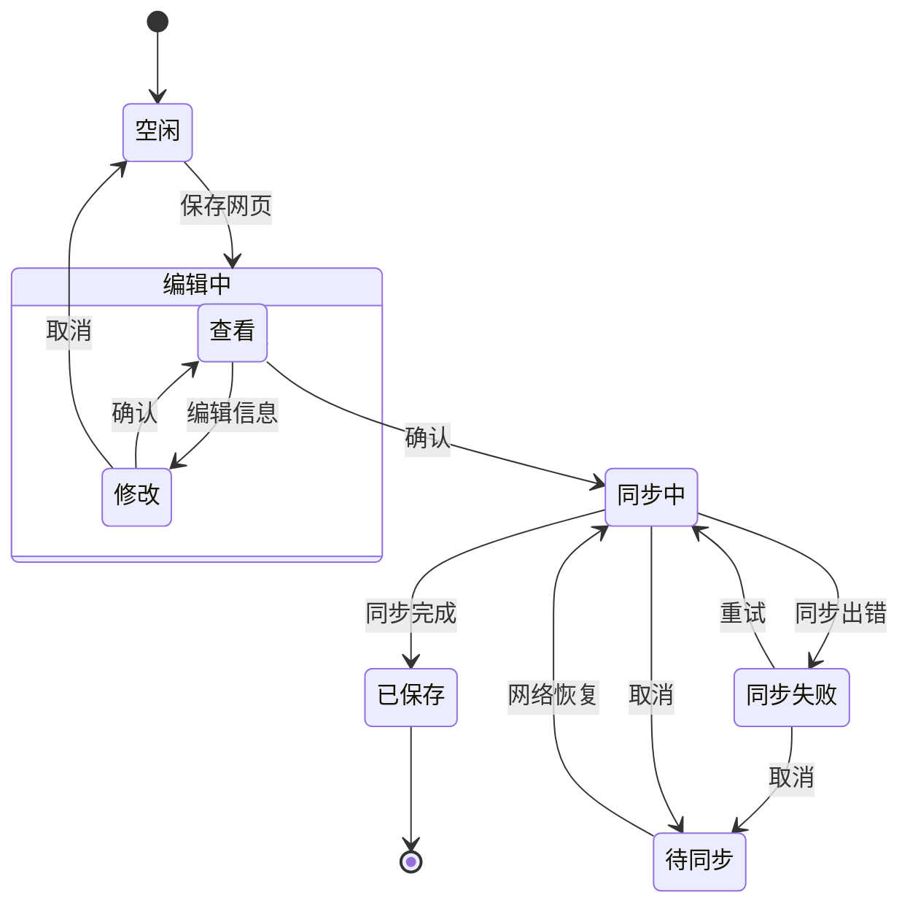
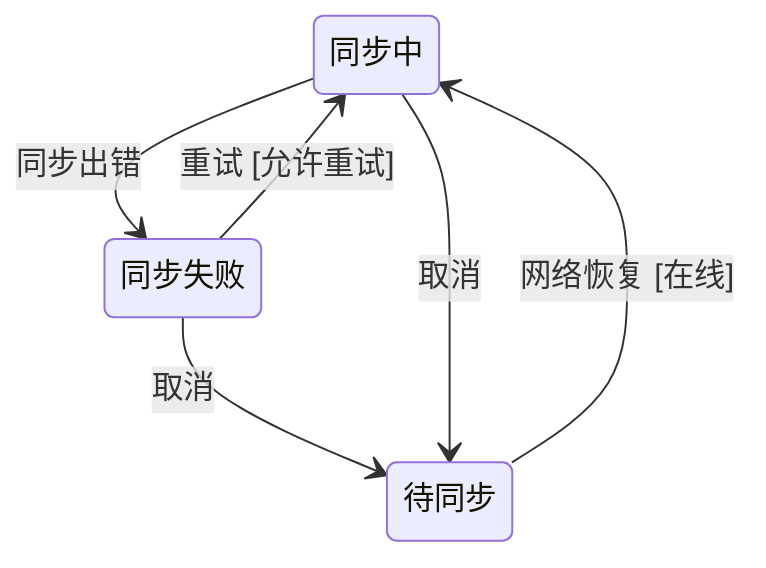
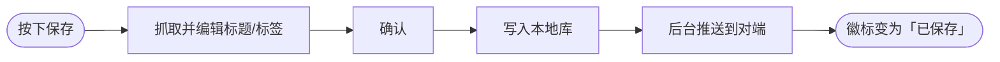

# save-bookmark — Behavior Views

> Fixture: YAML tier. The model (`behavior.yaml`) is the machine contract; these
> are hand-crafted views for the user's decisions. The prototype under
> `prototypes/save-bookmark/` mirrors the same states.

## Scenario episodes

1. **Happy** — Kayla hits ⌘S on a subway article; edits the fetched title, adds the
   tag `sewers`; online; sees "已保存" within ~2s.
2. **Offline** — same save with no signal: UI shows "已保存 · 待同步" immediately;
   when the train exits the tunnel, the badge flips to "已保存" without her touching
   anything (decided recovery: silent background sync, no modal).
3. **Peer down** — the sync peer is redeploying: after ~10s the badge shows
   "同步失败 · 重试"; she taps 重试 twice, then cancels — the bookmark stays readable
   and searchable, marked "待同步" (decided recovery: local truth is never blocked).
4. **Adversarial** — page has no title tag: the URL itself becomes the title
   (decided, no error state).

## View 1 — overall behavior (decision: is this the right shape?)

## View 2 — failure & cancel paths (decision: are these acceptable?)

## View 3 — happy path as a linear flow (companion to the state view)

> The state view above reads in states; this is the same main scenario as a linear
> process — for readers who think in steps. (Necessary companion when the module is
> state-like.)

## Acceptance criteria (excerpt — one Given/When/Then per transition)

- Given 空闲 When 保存网页 Then 编辑中（元数据已记录）
- Given 查看 When 确认 Then 同步中
- Given 同步中 When 同步出错 Then 同步失败（retryCount+1）
- Given 同步失败 When 重试 [允许重试] Then 同步中
- Given 同步中 When 取消 Then 待同步（已入同步队列）
- Given 待同步 When 网络恢复 [在线] Then 同步中
- … (full list: one per transition, 13 total)
