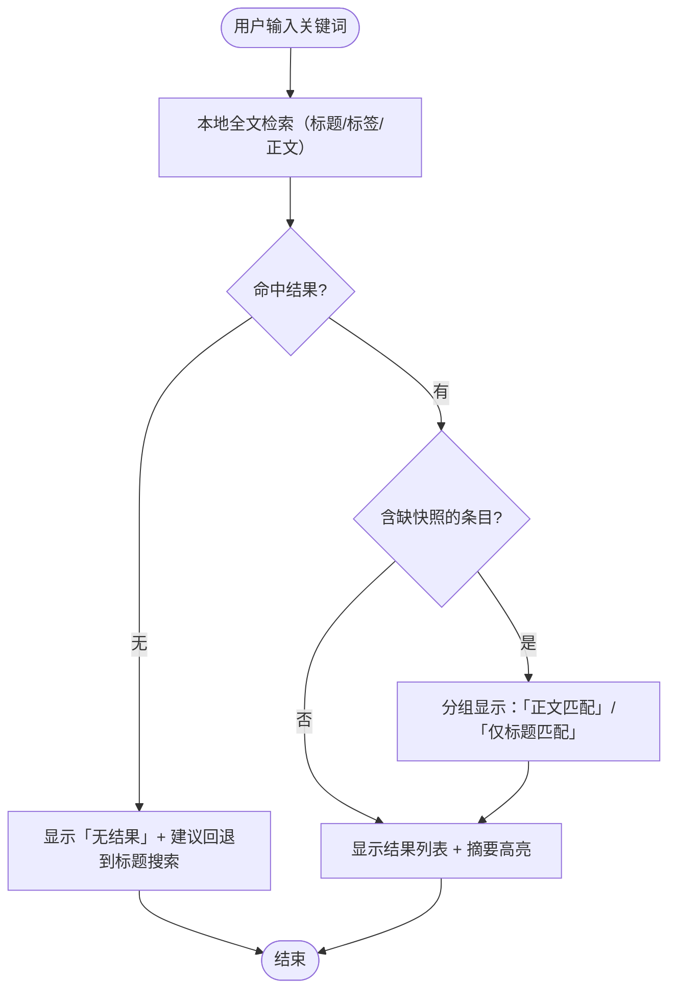

# search — Light-tier Behavior

> Fixture: light tier (no YAML model — linear flow with a few branches). One
> hand-crafted flowchart plus criteria is enough; say which tier and why: search is
> a one-shot transform with no persistent state machine.

## Scenario episodes

1. **Happy** — Kayla types "municipal sewers"; results list appears within ~300ms
   (local FTS); the phrase is highlighted in snippets.
2. **No results** — "sew3rs" typo: an explicit "无结果" state with the query echoed
   and a one-tap "搜索标题" fallback (decided: never a blank screen).
3. **Snapshot missing** — the matching article was saved without a snapshot: shown
   in results under a "仅标题匹配" group, opened as link+title only.

## Flow view

## Acceptance criteria

- Given any saved set When 输入关键词 Then results within ~300ms from local index
- Given no matches When search Then explicit 无结果 state with title-search fallback
- Given a snapshot-less bookmark matching only by title When search Then it appears
  under 仅标题匹配, never silently dropped
