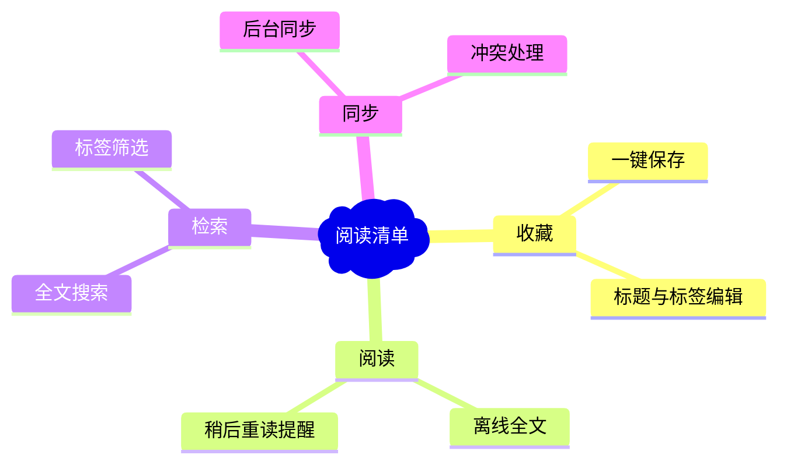

# Reading List — Requirement Brief

## Goal

One user, two devices: save an article in two seconds, find it again in five —
including by words inside the article, offline.

## Users & scenarios

- Primary persona: the single owner (see `direction/one-pager.md`).
- Core scenarios (one line each):
  1. Save the page I'm reading, tag it, move on.
  2. Three weeks later, find "that article about municipal sewers" by a phrase I remember.
  3. Read on the subway with no signal.

## Scope

### In scope

- Save with editable title/tags; instant local persistence.
- Full-text search over saved articles (local index).
- Background sync between devices via one peer service.
- Offline-first: everything readable/searchable with no network.

### Out of scope (explicit non-goals)

Inherited from the direction one-pager: social/sharing, third-party client sync,
recommendations. Also out: highlighting/annotation (deferred, see risks).

## Functional requirements

1. The user can save the current page with auto-fetched title and editable tags.
2. The user can search saved articles by title, tag, or any word in the article text.
3. The user can read any saved article fully offline.
4. The user sees pending/failed sync status per bookmark and can retry.
5. The user can pin and archive bookmarks.

## Constraints & non-functionals

- Desktop (primary) + mobile browser; no native app for v1.
- Data volume: ~5k articles × ~50KB snapshot ≈ 250MB ceiling.
- Local-first: all reads served from local storage; sync is background and optional.
- Privacy: snapshots may contain paywalled content — never leaves the user's devices
  except to their own sync peer.

## Open questions & risks

- Snapshot fetching will break on some sites (paywalls, JS-only pages) — default:
  save link + title, mark snapshot as missing, search skips it. (Accepted, see
  `commission.md`.)
- Highlighting: users will ask — default: non-goal for v1, revisit after usage.

## Scope map



## Priority view

> Optional diagram (trigger: > 5 competing stories, two dominant axes) — shown as a
> fixture of the quadrant option.```mermaid
%% title: Story priorities · value vs effort
%% caption: two axes dominated this trade-off — user value and build effort
quadrantChart
  title 需求优先级（价值 × 成本）
  x-axis "成本低" --> "成本高"
  y-axis "价值低" --> "价值高"
  quadrant-1 "重点规划"
  quadrant-2 "立即做"
  quadrant-3 "有空再做"
  quadrant-4 "暂缓观察"
  "一键保存": [0.25, 0.9]
  "全文搜索": [0.4, 0.85]
  "离线阅读": [0.3, 0.8]
  "后台同步": [0.7, 0.7]
  "冲突处理": [0.8, 0.45]
  "高亮批注": [0.6, 0.3]
```
