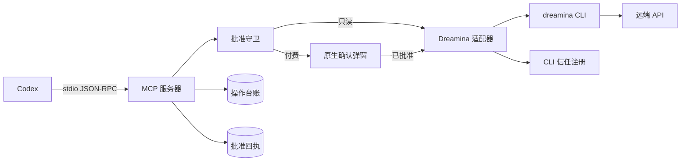

# Dreamina Design 插件

## 插件市场导航

本插件所属分类：**AIGC 内容创作**。

| 分类 | 插件市场入口 | 用途 |
| --- | --- | --- |
| 全栈开发 | [Full Stack Plugins](https://github.com/partme-ai/full-stack-plugins) | 架构与 UI 设计、代码理解、质量检查、代码审查、流程治理与服务器运维 |
| AIGC 内容创作 | [Full AIGC Plugins](https://github.com/partme-ai/full-aigc-plugins) | 图像、视频、音频、音乐、3D 与多模态内容创作 |


> 在受支持的编码智能体中创作 Dreamina 图片与视频：运行时发现 CLI 能力、每次付费调用都要明确批准、提交结果可凭标识续查。

[](https://github.com/full-aigc-plugins/dreamina-design-plugin/releases/tag/v0.7.0)
[](LICENSE)

[English](README.md) | [简体中文](README.zh-CN.md) · [安装](#安装) · [快速开始](#快速开始) · [MCP 工具](#mcp-工具) · [故障排查](#故障排查)

## 项目定位

`dreamina-design` 通过一个本地 stdio MCP 服务器，把官方 Dreamina CLI 以 21 个带类型的工具暴露给受支持宿主。每次付费调用都要通过服务端确认，每次提交都会拿到稳定的 `submit_id`，每个任务在重新提交之前都必须先查询。

插件是严格包装：CLI 负责认证与远端 API，模型参数来自实时 CLI schema，任何工具都不接受任意 shell 输入。

### 适合谁

- 希望在编码智能体里出图出片、同时又不想失去花费控制权的设计师与市场人员。
- 需要在厂商 CLI 之上获得带类型、可审计 MCP 面的工程师。
- 需要为每次付费动作拿到批准记录与可续查提交标识的审阅者。

### 解决什么问题

| 问题 | 本插件提供 | 可验证入口 |
|---|---|---|
| CLI 选项会漂移 | 能力快照与 CLI 状态工具读取实时 CLI | `dreamina_capability_snapshot`、`dreamina_cli_status` |
| 付费调用容易误触发 | 原生确认弹窗，默认动作是取消 | `scripts/native_approval.py` |
| 结果不确定时容易重复提交 | 按 `submit_id` 查询；绝不生成替代标识 | `scripts/operation_ledger.py` |
| CLI 二进制不可信 | 信任注册：绝对路径、属主校验与 SHA-256 | `scripts/trusted_cli.py` |

## 一眼看懂

```text
创作意图
      │
      ▼
┌──────────────────────────────────────────────────────────┐
│ dreamina-design                                    │
│  ① discover   实时 CLI 能力快照与状态                    │
│  ② contract   经过校验的生成请求                         │
│  ③ approve    付费调用走原生确认弹窗                     │
│  ④ submit     只提交一次，带稳定 submit_id               │
│  ⑤ query      按 submit_id 查询，可选下载                │
│  ⑥ validate   产物到达即校验                             │
└──────────────────────────────────────────────────────────┘
      │
      ▼
已下载的图片或视频产物 + 操作回执
```

| 项目属性 | 值 |
|---|---|
| 插件 ID | `dreamina-design` |
| 宿主 | Codex CLI 或 ChatGPT 桌面应用 |
| 当前版本 | `0.7.0` |
| 插件清单 | `.codex-plugin/plugin.json` |
| MCP 配置 | `.mcp.json`——本地 stdio 服务器 |
| 主要语言 | Python 3.13 |
| 许可证 | Apache-2.0 |

## 能力与边界

### 已支持

| 能力 | 输入 | 输出 | 限制 | 状态 |
|---|---|---|---|---|
| 能力发现 | 一个实时 CLI | 可信的能力快照与 CLI 状态 | 只读 | 稳定 |
| CLI 管理 | 安装或升级请求 | 从固定 HTTPS 安装器完成的可信安装 | 需要批准 | 稳定 |
| 认证 | OAuth 请求 | 登录、检查、重新登录或登出 | 需要批准 | 稳定 |
| 图片生成 | 已批准的请求 | 一次已提交的图片任务 | 消耗额度 | 稳定 |
| 视频生成 | 已批准的请求 | 一次已提交的视频任务 | 消耗额度；部分模式需要网页端前置 | 稳定 |
| 视觉质量循环 | 已锁定视觉目标 + 一次获批生成请求 | 内容绑定的轮次回执与独立 Judge 结果 | 首轮绝不自动重试；默认只允许一次且必须命中精确额度 | 本地契约已验证 |
| 参考视频工程 | 源视频、重设计与闭合批次报价 | 持久化分析、生成、评价、合成与导出回执 | 付费执行继续受审批约束 | 生产 MCP 调用链已注册 |
| 任务处理 | 一个 `submit_id` | 状态与可选的校验下载 | 只查询，绝不重新提交 | 稳定 |
| 会话管理 | 会话请求 | 创建、列出、搜索、重命名、删除 | 写操作需要批准 | 稳定 |
| 诊断 | 日志请求 | 有界且脱敏的 CLI 日志片段 | 只读 | 稳定 |
| 参考视频工程 | 工程工作流请求 | 版本化工程、报价、执行、合成、导出 | 新增工程工具的运行状态记为 `NOT_RUN` | 实验性 |

### 不负责

- 拥有认证。`dreamina` CLI 负责认证；本仓库只通过仅用 argv 的适配器包装它。
- 决定花钱。只有经原生弹窗确认的明确批准才会释放付费调用。
- 绕过网页端前置。某个视频模式需要先在网页完成某些操作时，插件只做报告。
- 重试提交。结果不确定时按 `submit_id` 查询，绝不重新提交。
- 任意 shell 或 argv 执行。没有任何工具暴露自由格式命令。

### 成熟度

| 状态 | 含义 |
|---|---|
| 稳定 | 有自动化测试与已记录运行证据 |
| 实验性 | 契约仍在演进；运行门禁为 `NOT_RUN` |
| 封锁 / NOT_RUN | 未验证；不得描述为可用 |

## 架构与核心流程



### 组件职责

| 组件 | 负责 | 不负责 |
|---|---|---|
| `scripts/dreamina_mcp_server.py` | 工具分发、错误信封、stdio JSON-RPC | 厂商行为 |
| `scripts/dreamina_adapter.py` | 仅用 argv 调用 CLI 并给出带类型的失败 | 批准决策 |
| `scripts/approval_guard.py` | 一次性批准回执与拒绝重放 | 成本估算 |
| `scripts/operation_ledger.py` | 以 `submit_id` 为键的回执 | 认证 |
| `scripts/trusted_cli.py` | 信任注册与 CLI 身份的保护性存储 | CLI 安装 |
| `scripts/native_approval.py` | 失败即关闭的原生确认弹窗 | 业务规则 |
| `scripts/image_service.py`、`scripts/video_service.py`、`scripts/task_service.py` | 请求构造、提交与查询 | 目录值 |
| `skills/`（21 个） | 供支持宿主使用的路由与逐能力指令 | 运行时强制 |

## 旧版 CLI 停维护预告 —— 请规划 Canvas 迁移

`dreamina` 二进制将在 **2026-11** 后停止维护。自 0.7.0 起本插件采用**双轨**：
付费提交工具默认走 Canvas 运行时（`dreamina-canvas` CLI，报价绑定审批），
`runtime: "legacy"` 保留冻结的 `dreamina` 路径直至其退场。`scripts/router_skill.py`
仍通过 `Router.canvas_successor()` 给出每条冻结意图的继任映射；适配器移植完成后，
下表已是本插件自身 Canvas 轨可执行的路径：

| 意图 | 冻结路径（本插件仍可执行） | Canvas 继任 |
|---|---|---|
| 文生图 | `dreamina-cli-text2image` | `dreamina-canvas-cli-text2image` |
| 图生图 | `dreamina-cli-image2image` | `dreamina-canvas-cli-image2image` |
| 文生视频 | `dreamina-cli-text2video` | `dreamina-canvas-cli-text2video` |
| 图生视频 / 首尾帧 / 多帧 / 多模态 | `dreamina-cli-*` | `dreamina-canvas-cli-ref2video`（Canvas 无 `i2v`） |
| 语音 | — | `dreamina-canvas-cli-text2voice` |
| 音乐 | — | `dreamina-canvas-cli-text2audio` |

### Canvas 运行时（默认）

`dreamina_submit_image` / `dreamina_submit_video` 新增：

- `runtime` — `canvas`（默认）或 `legacy`。
- `project_id` — 复用既有画布；不传时可传 `canvas_name` 新建（画布创建是远端写
  操作，会单独请求一次批准）。
- `credit_ceiling` — 可选；缺省取已保存草稿的实时报价上限。

Canvas 轨先对草稿报价，把审批指纹绑定到该实时金额，再执行
`node confirm → node run → operation wait`（submitId 稳定不变）。Canvas 二进制的
信任注册独立存放：`~/.config/dreamina-design/trusted-canvas-cli.json`（与 legacy
信任库同样的 0600 契约）。详见 `docs/canvas-runtime.md`。

## 兼容性

| 插件版本 | 宿主 | CLI | Python | 状态 |
|---|---|---|---|---|
| `0.7.0` | Any MCP client with stdio support | `dreamina-canvas` CLI enrolled and trusted | 3.13 | Dual-rail port: submit tools default to the Canvas runtime (quote-bound approval, projectId/canvas_name/credit_ceiling), `runtime: legacy` keeps the frozen path; router successor table is now executable |
| `0.7.0` | 任意支持 stdio 的 MCP 客户端 | 已注册并信任的 `dreamina-canvas` CLI | 3.13 | 双轨移植：提交工具默认 Canvas 运行时（报价绑定审批，新增 projectId/canvas_name/credit_ceiling），`runtime: legacy` 保留冻结路径；路由继任表已可执行 |
| `0.6.2` | 任意支持 stdio 的 MCP 客户端 | 已从官方安装器安装并完成信任注册的 `dreamina` CLI | 3.13 | 显式声明旧 CLI 停维护边界：`router_skill.py` 将每条冻结路由映射到对应 `dreamina-canvas-cli*` 继任（技能名 + 安装提示）；适配器移植前冻结执行路径不变 |
| `0.6.1` | 任意支持 stdio 的 MCP 客户端 | 已从官方安装器安装并完成信任注册的 `dreamina` CLI | 3.13 | 上游 `dreamina-skills` 4e776ac（v1.7.0）重新 vendor：17 个 vendored 技能刷新，冻结的旧 CLI 与 Prompt/OpenCLI 行为不变；补声明 `dreamina-video-shots` / `dreamina-video-sync` 为本地技能 |
| `0.6.0` | 任意支持 stdio 的 MCP 客户端 | 已从官方安装器安装并完成信任注册的 `dreamina` CLI | 3.13 | 22 个工具已注册；本地生产分发已验证 |
| `0.6.0` | Codex / Claude Code / ZCode / Kimi 通过 `JudgePort` | 同上 | 3.13 | 视觉契约与额度门禁已验证；真实付费金丝雀仍需单独审批或记为 `NOT_RUN` |

付费金丝雀门禁单独记录：要么单独批准，要么标记为 `NOT_RUN`。运行门禁条目可被以下命令检查：

```bash
python3 scripts/validate_distribution_v7.py --plan-gate
python3 scripts/validate_distribution_v7.py --require-runtime-gates
```

## 安装

### 前置条件

- MCP 服务器可用的 Python 3.13。
- `dreamina` CLI：从 <https://jimeng.jianying.com/cli> 安装，并通过原生信任弹窗完成注册。
- 仅参考视频工程工具需要（可选）：`ffmpeg`、`ffprobe`、兼容 Whisper 的 ASR 运行时，以及 macOS 的 `say`。

### 从插件市场安装

```bash
codex plugin marketplace add full-aigc-plugins/dreamina-design-plugin --ref v0.7.0
codex plugin add dreamina-design@partme-ai-dreamina-design
```

重启 Codex 或 ChatGPT 桌面应用，然后新建任务，让 MCP 服务器启动并加载 Skills。

### 确认加载成功

```bash
codex plugin list
```

预期条目：

```text
dreamina-design@partme-ai-dreamina-design  installed, enabled
```

再确认 MCP 服务器已注册、CLI 已被信任：

```bash
codex mcp list
```

让 Codex 读取 CLI 状态与账号就绪度。只读工具不会弹窗；付费工具会拉起原生确认。

### 国内镜像（AtomGit）

如果 GitHub 访问缓慢或不可达，可改用 AtomGit 镜像安装。命令完全一致，只把市场地址换成镜像：

```bash
codex plugin marketplace add https://atomgit.com/partme-ai/partme-dreamina-design.git --ref main
codex plugin add dreamina-design@partme-ai-dreamina-design
```

如需一步安装 partme-ai 全部插件目录：

```bash
codex plugin marketplace add https://atomgit.com/partme-ai/plugins.git
codex plugin add dreamina-design@partme-ai-dreamina-design
```

注意事项：

- AtomGit 源与 GitHub 源共用市场名，后添加的会覆盖先添加的。切回官方源执行
  `codex plugin marketplace add https://github.com/partme-ai/plugins.git`。
- ZCode 与 Kimi 用户可先将镜像仓库克隆到本地，再在各平台的 marketplace 配置中登记本地目录。

## 快速开始

### 1. 先完成一次 CLI 信任注册

第一次需要 CLI 的工具调用会弹出原生对话框，要求你确认二进制的绝对路径与摘要，默认动作是取消。

### 2. 生成一张图

```text
按这个简报生成一张 Dreamina 图片：亚光陶瓷茶壶放在亚麻桌布上，清晨柔光。
```

预期观察：先取能力快照，再构造并校验请求，然后用原生弹窗确认确切参数，最后只提交一次并拿到 `submit_id`。

### 3. 查询并下载

```text
查询那个任务并下载结果。
```

预期观察：任务按 `submit_id` 查询，产物到达即校验。若结果仍在处理中，插件只报告状态，不会重新提交。

## 配置

| 设置 | 位置 | 说明 |
|---|---|---|
| MCP 服务器 | `.mcp.json` | stdio；启动超时 10 秒，工具超时 3600 秒 |
| 工具批准模式 | `.mcp.json` | 只读工具为 `approve`，付费与写类工具为 `prompt` |
| 受信 CLI 记录 | `~/.config/dreamina-design/trusted-cli.json` | 文件权限 `0600`，目录权限 `0700`；保存路径与摘要 |
| 状态根目录 | `~/.local/share/dreamina-design/` | 内含 `operations/` 与 `approvals/` |
| CLI 诊断日志 | `~/.dreamina_cli/logs` | 仅通过有界且脱敏的诊断工具读取 |
| 透传环境变量 | `HOME`、`TMPDIR`、`LANG`、`LC_ALL`、`PATH` | 在 `.mcp.json` 中声明 |

## MCP 工具

### 只读工具（自动批准）

| 工具 | 用途 |
|---|---|
| `dreamina_capability_snapshot` | 读取可信的 CLI 能力快照 |
| `dreamina_cli_status` | 检查 CLI 安装、版本与命令帮助 |
| `dreamina_account` | 读取脱敏的账号与额度就绪度 |
| `dreamina_query_task` | 按 `submit_id` 查询，可选下载 |
| `dreamina_list_tasks` | 用有界过滤条件列出任务 |
| `dreamina_diagnose` | 读取有界且脱敏的 CLI 日志 |
| `dreamina_quote_video_batch` | 枚举确切的请求集合并返回不可变报价 |

### 付费或写类工具（需要原生确认）

| 工具 | 用途 |
|---|---|
| `dreamina_cli_install_or_upgrade` | 从固定 HTTPS 安装器安装或升级 |
| `dreamina_auth` | OAuth 登录、检查、重新登录或登出 |
| `dreamina_submit_image` | 提交一次已批准的付费图片请求 |
| `dreamina_submit_video` | 提交一次已批准的付费视频请求 |
| `dreamina_visual_loop` | 驱动视觉质量闭环：锁定目标、执行一轮已批准的付费生成、记录宿主的独立评审结论，至多一次受精确指纹额度约束的重试 |
| `dreamina_session` | 创建、列出、搜索、重命名或删除 Session |
| `dreamina_video_project` | 创建、查看、列出或恢复视频工程，并注册媒体工具 |
| `dreamina_analyze_reference_video` | 灌入源视频并派生帧、拼图与重剪 |
| `dreamina_validate_shot_analysis` | 持久化语义分镜标注 |
| `dreamina_create_redesign` | 创建创意设计版本（原创或经授权的复刻） |
| `dreamina_approve_video_batch` | 经原生确认后激活一次不可扩展的整批额度 |
| `dreamina_execute_video_batch` | 运行、核对或恢复已激活的批次 |
| `dreamina_evaluate_video_batch` | 为单次镜头尝试记录可测与语义门禁 |
| `dreamina_compose_video` | 构建封闭时间线并渲染临时终版 MP4 |
| `dreamina_export_video_project` | 校验渲染出的 MP4 并导出到已批准的目标位置 |

### 视觉质量循环契约

- `VisualTargetReceipt` 在生成前锁定目标文件字节、尺寸、来源和授权目录。
- `VisualRoundReceipt` 绑定付费请求指纹、返回产物、独立 Judge 证据、评分、阻塞差距和下一步动作。
- `JudgePort` 与宿主无关：Codex、Claude Code、ZCode、Kimi 或其他 MCP 宿主提供评价适配器，业务层不导入 Codex 子代理 API。
- 首轮不通过时停在 `awaiting_approval`，不会再次提交。默认只允许一次重试，而且必须激活同时匹配精确请求指纹和信用额度上限的 allowance。
- `ReplanPort` 可以在不消耗额度的前提下提出修复请求；提案必须持久化并按精确指纹和信用额度审批，只有显式 `max_attempts=3` 的循环才能进入第三轮。
- 视频批次评价使用已验证的关键帧锚点和 `VideoEvaluationService`。`CompanionDccPreviewPort` 将现有 Blender/Maya argv+JSON handoff 接入同一 Judge 与回执链，缺少 companion 时失败关闭。

### 错误信封

失败时返回结构化信封：`error_type`、`message`、`retryable`、`requires_user_action` 与 `next_action`。`next_action` 取值之一：`request_user_action`、`query_same_submit_id` 或 `correct_request`。

## 重试、幂等与恢复

- 结果不确定时按 `submit_id` 查询；提交绝不盲目重试。
- 提交结果含糊时会消耗预留名额并进入人工复核，而不是重试。
- 视觉首轮评价不会创建第二个付费请求；重试必须持有精确请求指纹 allowance，且不得超过获批信用额度上限。
- 批准回执一次性使用、五分钟过期，并绑定到会话与请求。
- 任务状态字符串会被归一：`querying`、`queued`、`pending`、`processing`、`running`、`generating` 一律报告为 `querying`。
- 操作的终态为 `succeeded`、`failed`、`cancelled`。
- 本地上传输入由 `scripts/reference_policy.py` 约束：单图至多 50 MiB、单媒体至多 512 MiB，并做类型与边界校验。

## 数据与状态

| 数据 | 位置 | 生命周期 | 是否含秘密 |
|---|---|---|---|
| 操作回执 | `~/.local/share/dreamina-design/operations/` | 直到你删除 | 否；标识、哈希、状态与时间戳 |
| 批准回执 | `~/.local/share/dreamina-design/approvals/` | 五分钟或一次性 | 否；落盘前会剥离形似凭据的键 |
| 受信 CLI 记录 | `~/.config/dreamina-design/trusted-cli.json` | 直到你重新注册或删除 | 否；仅路径与摘要 |
| 已下载产物 | 你选择的目标位置 | 直到你删除 | 否 |

## 安全

- 认证留在 `dreamina` CLI；本仓库不保存凭据。
- 每次付费或写类调用都经过原生确认弹窗，默认动作是取消。
- CLI 信任要求绝对且非符号链接的路径、可信属主与权限，以及 SHA-256 摘要。
- 批准持久化会剥离形似凭据的键，并在写入前拒绝账号快照类键。
- 工具调用只用 argv 数组；任何工具都不接受自由格式命令字符串。
- 诊断有界且脱敏；绝不整体倾倒日志。

## 开发与验证

```bash
python3 scripts/validate_distribution.py .
python3 -m unittest discover -s tests
```

其他门禁：

```bash
python3 scripts/validate_distribution_v7.py --require-runtime-gates
python3 scripts/verify_skill_snapshot.py --strict
python3 scripts/run_strict_trace.py
python3 scripts/unlock_runtime_gates.py status
```

仓库中已记录的证据：

- [离线验证](docs/verification/offline.md)，以及参考视频运行记录 `docs/verification/reference-video-runtime-2026-09-14.md`；该记录中十条参考视频门禁均为 `NOT_RUN`。
- [Skill 发现](docs/verification/skill-discovery.md) 与[严格 TRACE](docs/verification/skill-trace.md)。
- [授权决定记录](docs/verification/authorization-decision.md) 与付费金丝雀记录。
- [CLI 运行期](docs/verification/dreamina-cli-runtime.md)，以及已记录的 CLI 帮助、schema 与摘要。

## 故障排查

| 现象 | 优先检查 | 处理方式 |
|---|---|---|
| 工具缺失 | `codex mcp list` | 确认插件已启用并新建任务 |
| 付费调用被拦住 | 确认弹窗 | 明确确认；默认动作是取消 |
| CLI 未受信任 | 信任记录 | 重新注册 CLI 并确认摘要 |
| 任务看起来卡住 | 任务状态 | 按 `submit_id` 查询；不要再次提交 |
| 需要登录 | 账号就绪度 | 用认证工具登录，然后重试只读检查 |
| 某个视频模式被拒 | 网页端前置 | 先在网页完成前置；插件只报告，不绕过 |
| 参考视频工具没有反应 | 运行门禁记录 | 在门禁通过之前，这些工具记为 `NOT_RUN` |

## 项目结构

```text
partme-dreamina-design/
├── .codex-plugin/plugin.json   # 身份与展示元数据
├── .mcp.json                   # 本地 stdio MCP 服务器声明
├── .agents/plugins/marketplace.json
├── scripts/                    # MCP 服务器、适配器、服务、守卫、校验器
├── skills/                     # 21 个 Skill，其中 13 个固定到上游快照
├── tests/                      # 单元与契约测试
└── docs/                       # 架构、技术方案、验证记录
```

## 深入文档

- [Architecture](docs/Dreamina-Design-Plugin-Architecture.md) · [架构文档](docs/Dreamina-Design-Plugin-Architecture.zh_CN.md)
- [Technical solution](docs/Dreamina-Design-Plugin-Technical-Solution.md) · [技术方案](docs/Dreamina-Design-Plugin-Technical-Solution.zh_CN.md)
- [设计规格](docs/superpowers/specs/2026-09-11-dreamina-design-plugin-design.md)
- [生产就绪加固计划](docs/superpowers/plans/2026-09-12-production-readiness-hardening.md)

## 贡献与支持

功能问题请提交到 <https://github.com/full-aigc-plugins/dreamina-design-plugin/issues>。提交变更前，请说明你验证所用的 CLI 版本、是否改动批准信封或回执格式，并附上受影响的门禁输出。

## 许可证

Apache-2.0，见 [LICENSE](LICENSE)。
