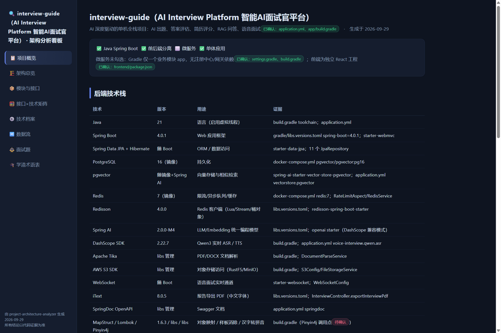
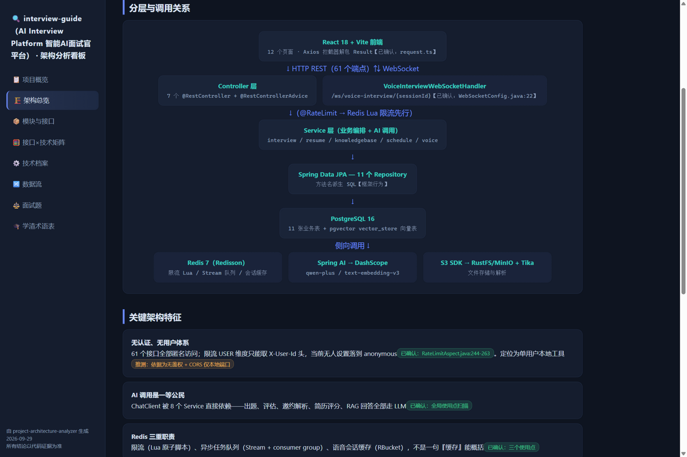
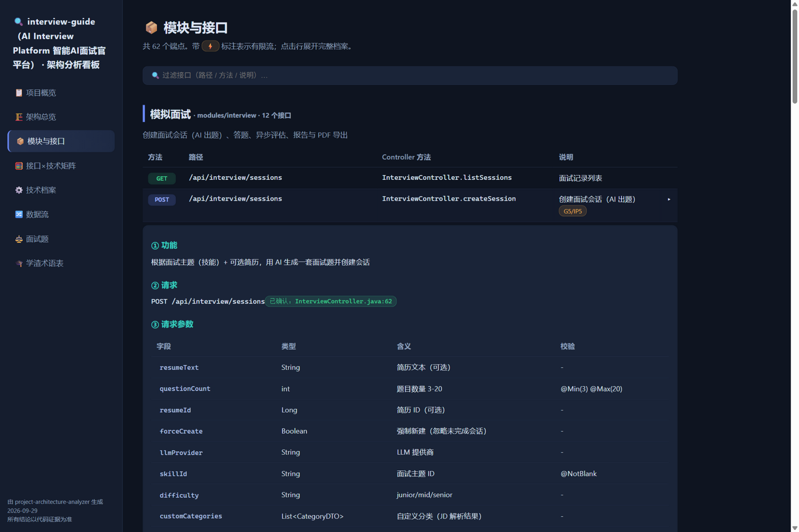
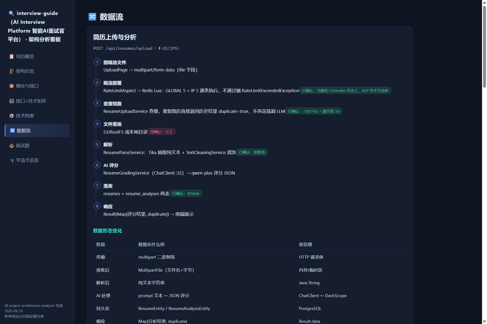

# Project Architecture Analyzer · 项目架构逆向分析 Skill

把一个真实的企业级 Java 项目转换成**一个可点击探索的可视化看板**（单文件 HTML，双击即开，无需构建与联网）：

架构分层图 → 业务模块 → 接口档案 → 调用链 → 数据流 → 技术"为什么存在" → 接口×技术矩阵 → 学渣版解释 → 基于真实代码的面试题

适用于 ZCode（SKILL.md 通用技能格式）。



## 这不是又一个"代码总结器"

**第一原则：绝对不能"猜代码"。** 逆向分析最大的风险是用"常见项目套路"填补没读到的部分——对学习者来说，一条虚构的调用链比没有分析更有害。

| 标记 | 含义 | 渲染效果 |
|---|---|---|
| 【已确认】 | 代码中直接存在，给出文件/方法级证据 | 绿色徽章 |
| 【推测】 | 合理推断，必须写明依据 | 橙色徽章 |
| 【框架行为】 | 框架自动配置/内置机制（如 JPA 方法名派生 SQL），非业务代码 | 蓝色徽章 |
| 【待确认】 | 没读到就不编，同时给出"去哪里确认"的线索 | 红色徽章 |

看板中的每一条结论都带证据徽章。实测中它正确识别了一个"反套路"项目：**Spring Data JPA 而非 MyBatis-Plus、React 而非 Vue、PostgreSQL+pgvector 而非 MySQL、61 个接口全部匿名（无登录体系）、Redis 一件三用（Lua 限流 / Stream 队列 / 会话缓存）**——而不是按惯性输出"Redis=缓存、Vue+SpringBoot+MyBatis"。

## 三种模式

| 模式 | 触发语 | 产出 |
|---|---|---|
| 🔍 **全量分析** | "全量分析"、"项目体检"、"这个项目用了什么技术" | 完整看板 `docs/architecture-analysis.html` |
| 🎯 **功能分析** | "分析登录/订单/XX功能"、"讲讲这个接口"、"继续"下钻 | 单页功能看板 `docs/feature-{功能}.html`（13 步固定拆解） |
| ⚖️ **面试审判** | "面试审判"、"给我出项目面试题" | 对话中先答后看，可回填看板面试题页 |

值得强调的防脑补行为：**当用户要求分析的功能在项目中不存在时，skill 会如实报告"未找到相关代码"、列出最接近的候选并等待确认——绝不虚构一个登录功能硬讲。**



## 看板里有什么

- **项目概览**：类型勾选（勾/不勾都带依据）、后端/前端技术栈表（版本必须来自构建文件）、运行环境、核心结论、【待确认】清单
- **架构总览**：真实包结构、CSS 拼装的分层调用图（只画真实存在的组件）、关键架构特征、其他组件速览
- **模块与接口**：全部端点清单（可搜索过滤），核心接口带十节完整档案（功能/请求/参数/Controller/Service/数据访问/数据库/使用技术/调用链/数据流）
- **接口×技术矩阵**：打 ✓ 的唯一依据是该接口调用链中真实出现该技术，未出现一律 `-`
- **技术档案**：每个被业务真实使用的技术一份"为什么存在"档案（在哪里用/怎么用/存什么/为什么/没有它会怎样/与其他组件的关系/学渣版）
- **数据流**：编号时间线 + 数据形态变化表（每一步数据长什么样、放在哪个对象里）+ 关键设计点
- **面试题**：先自己答、点击展开参考答案与追问（追问链式深入）
- **学渣术语表**：大白话 ↔ 正式术语对照，比喻基于本项目真实结构





## 安装

```bash
git clone https://github.com/WhQ-cc/project-architecture-analyzer.git
mkdir -p ~/.zcode/skills
cp -r project-architecture-analyzer ~/.zcode/skills/
```

> Windows 下技能目录为 `%USERPROFILE%\.zcode\skills\`。重启 ZCode 后生效；也可用 cocoloop 等技能管理器安装。

## 使用

在目标项目目录打开 ZCode（或把项目路径发给 agent）：

```
全量分析 E:\path\to\your-project     # 生成完整看板
分析登录功能                          # 单功能 13 步深钻
面试审判                              # 基于真实代码出 10 题
继续                                  # 在当前模式下向下深挖一层
```

分析完成后双击 `docs/architecture-analysis.html` 即可浏览；产出会写入目标项目的 `docs/`，已有 `docs/` 时自动改用子目录避免污染。

## 技术栈范围

- **主场**：Java 后端（Spring Boot，Maven/Gradle 均可；MyBatis-Plus / JPA / Sa-Token / JWT / 无认证体系；Redis / MQ / MySQL / PostgreSQL 等），前端识别 Vue / React
- **可用但未实测**：非 Java 后端（术语体系按实际语言自适应）、多模块工程
- 数据访问层术语跟随项目实际技术（Mapper / Repository / DAO），不硬套 MyBatis 词汇

## 文件结构

```
project-architecture-analyzer/
├── SKILL.md                      # 主文件：身份、第一原则、模式路由、看板输出约定
├── assets/
│   └── dashboard-template.html   # 看板模板（CSS+渲染器+DATA 填写区）
├── references/
│   ├── evidence-rules.md         # 证据分级规则与六条严禁（第一原则详细版）
│   ├── full-analysis.md          # 模式一：全量分析 9 阶段
│   ├── feature-analysis.md       # 模式二：功能分析 13 步
│   ├── interview-mode.md         # 模式三：面试审判
│   └── dashboard-data.md         # 看板 DATA 数据结构规范
└── docs/screenshots/             # 看板演示截图（来自一次真实分析）
```

## 设计说明

- **渐进式披露**：SKILL.md 仅 90 行，细节分布在 5 个按需加载的 reference 文件中
- **模板 + 数据填充**：分析产出统一为 DATA 数据对象，渲染由模板负责，保证每次产出风格一致；填数前先 `cp` 模板再 `Edit` 数据区，节省 token
- **防污染**：文档只写进目标项目 `docs/`，已存在时自动改用子目录；skill 自身不修改项目代码

## License

[MIT](LICENSE)
