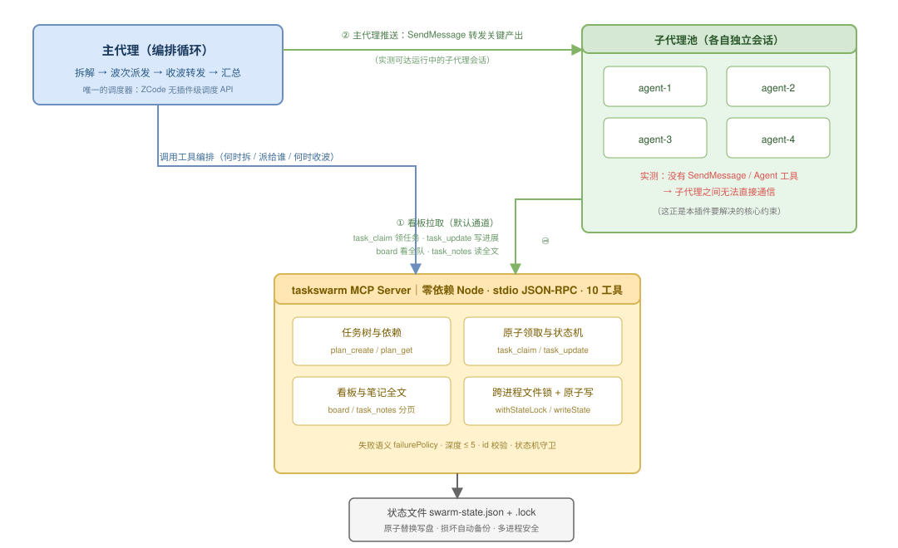

# TaskSwarm · 任务蜂群

> 多 Agent 编排引擎：把一个目标拆成任务树，按依赖波次并行派发子代理，用共享看板让互不可见的子代理"看见"彼此。**MCP 服务端零依赖、三平台共用**（ZCode / dsh / Codex CLI）。

[English](README.en.md) | 中文

[](#测试与可靠性)
[](#测试与可靠性)
[](#工程要点)
[](https://nodejs.org)

---

## 平台适配现状

**一份 `mcp/server.mjs`，三个宿主共用**——差异只在"谁派发子代理、子代理能不能说话"。

| | ZCode | dsh（DeepSeek Harness） | Codex CLI |
| --- | --- | --- | --- |
| MCP 挂载 | 插件自带（`.zcode-plugin/`） | `@deepseek-ai/dsh-mcp-client`（stdio） | `[mcp_servers.taskswarm]` |
| 工具前缀 | `mcp__plugin_taskswarm_taskswarm__*` | `mcp__taskswarm__*` | `mcp__taskswarm__*` |
| 派发子代理 | `Agent`（`run_in_background`） | `subagent`（`spawn`/`fork`） | `.codex/agents/*.toml` + `multi_agent` |
| 父→子推送 | `SendMessage`（运行中途中送达；**已 `done` 的可唤醒续跑**） | **`send_message`**（可续期） | ❌ 无 |
| 子→父回报 | ❌ 无 | **`report`** | ❌ 无 |
| 观察/干预 | ❌ 无 | **`list_agents` / `interrupt_agent`** | ❌ 无 |
| 适配成熟度 | **原生**（本插件诞生于此） | **MCP 链路已实测**（11 工具全通）；编排按原生工具映射 | MCP 挂载已确认；**子代理继承 MCP 工具随版本变化，需自行验证** |

**结论**：看板通道在所有宿主可用——这就是跨平台的意义。dsh 另有子代理 ↔ 父代理直连通道，
能力比 ZCode 版更强（看板从"唯一通道"降级为"公共黑板 + 持久化事实源"）。

> **验证边界（不夸大）**：三个宿主里，**只有 ZCode 是端到端跑过真实蜂群的**（本插件诞生于此，
> 172 个测试全部跑在该路径上）。dsh 验证到"MCP 链路 + 11 工具 + 依赖守卫"这一层（以
> `dsh-mcp-client` 相同的方式逐步驱动）；Codex 验证到"MCP 挂载成功"。**两边的"模型驱动完整蜂群"
> 都还没跑过**——测试当日所有可用中转 key 余额不足。Codex 另有一项版本相关风险：
> 子代理能否继承父会话的 MCP 工具随版本变化，需自行验证。详见各 `adapters/` 文档的实测记录表。

适配配置与实测记录见 [`adapters/dsh/`](adapters/dsh/README.md) 与 [`adapters/codex/`](adapters/codex/README.md)。

---

## 30 秒看懂

单个 AI 子代理能力很强，但**一次只能干一件线性的事**。面对"重构登录模块 + 补齐测试 + 更新文档"这种可并行的任务，只能串着做。

TaskSwarm 让主代理把目标拆成**任务树**，把互不依赖的部分**同时**派给多个后台子代理，再用一块共享看板让它们交换进度——最后主代理收波、转发关键产出、汇总。

```
一个目标  →  任务树（带依赖）  →  按波次并行派发  →  共享看板互通  →  汇总
```

## 核心设计洞察：子代理之间没有通信能力

这是本插件要解决的**根本约束**，也是它与"主代理随手开几个子代理"最大的不同。
（下述探测在 ZCode 上做的；dsh 的子代理体系更完整，见 [平台适配现状](#平台适配现状)。）

我在实现前先做了能力探测，实测结论：

| 能力 | 主代理 | 子代理 |
| --- | --- | --- |
| 启动子代理（`Agent`） | ✅ 有 | ❌ **没有** |
| 给别的代理发消息（`SendMessage`） | ✅ 有 | ❌ **没有** |
| 调用 MCP 工具 | ✅ 有 | ✅ **有** |

也就是说：**子代理是一群"哑"worker——干得了活，喊不了话，也生不出小代理。**

这个约束直接决定了两条通信通道：

1. **看板拉取（默认通道）**：子代理通过 MCP 主动读写共享看板。领任务用 `task_claim`、汇报进度用 `task_update`、了解全队状态用 `board`、读同伴的完整结论用 `task_notes`。因为是"拉取"，子代理永远不需要别人主动通知它。**看板可读也可写**——任何代理都能给任意任务卡留言（`task_update` 的 owner 校验只管状态变更），这是子代理之间真正的双向通道。

   3.0 把收信体验补齐了：`task_claim` 的返回**带全量历史笔记**（领取即开工，不必二次查询）；`board` 每任务给**最近 2 条**摘要（各 80 字符）+ 总数提示；留言不再抢占任务归属。仍然保留的拉取语义：子代理侧没有订阅式推送（有 `rev` 版本号可轮询对比、可选 webhook 推给外部集成），人类侧由 Web 控制台的 SSE 实时刷新。
2. **主代理推送（补强通道）**：主代理是唯一有 `SendMessage` 的角色，因此它承担"信息搬运工"：派发新任务时把上游产出写进子代理 prompt；收到某子代理完成通知后，把关键结论转发给正在跑的、与之相关的其他子代理。**这条通道我做了实测，而且两种状态都通**：给一个正在执行长任务的子代理推送带验证码的消息，它中途收到且没被打断；给一个**已经置 `done`** 的子代理推送追问，它被**在后台唤醒续跑**，并**保留了完整上下文**——能从自己先前写的示例数据反推出费率、承认原稿缺陷、并主动把补订结论写回自己的任务卡。所以"追问一个已完成的同伴"是可行的，只是必须经主代理这一跳。



*（可编辑源文件：[`docs/architecture.drawio`](docs/architecture.drawio)）*

## 为什么不能直接用现成的

调研结论（2026-09）：**Claude Flow / Ruflo**（61k★）、**barkain/claude-code-workflow-orchestration**、**Agent Teams** 都是 Claude Code 专用，依赖 ZCode 没有的 `TaskCreate` / `TeamCreate` / hooks 实验机制，无法移植。

而 ZCode 这边：原生子代理**可以调用 MCP 工具**（已探针验证），但没有 SendMessage —— 所以互通必须设计成"看板拉取 + 主代理推送"双通道，而不可能靠代理间直连。

（dsh 的情况更好：它原生提供 `send_message` / `report` / `list_agents`，子代理与父代理可直连。
本插件的看板通道在这两个宿主都可用，dsh 上还能叠加直连通道。）

本插件的架构是 **「MCP 提供确定性能力 + SKILL.md 提供编排流程」**：

- **确定性部分全部下沉到 MCP Server**：任务树存储、依赖判定、防重复领取、并发写盘、看板渲染、笔记分页。这些是"有明确正确答案"的事，不该交给 LLM 每次自由发挥。
- **编排循环留给主代理**：何时拆解、拆多细、派给谁、何时收波、如何转发——这些需要判断力，ZCode 没有插件级调度 API 可挂，主代理本身就是调度器。

## 安装

需要 **Node.js ≥ 23.4**（内置 `node:sqlite`），零第三方依赖。

```bash
git clone https://github.com/Wersky/taskswarm.git
npm link   # 可选：把 taskswarm（CLI）/ taskswarm-mcp（MCP server）挂进 PATH
```

### ZCode

**设置 → 插件管理 → 发现 → 「+」添加本地目录市场**，指向包含 `marketplace.json` 的目录，安装 `taskswarm`，重启会话。

插件清单使用 `${ZCODE_PLUGIN_ROOT}` / `${ZCODE_PROJECT_DIR}` 占位符，**不硬编码任何本机绝对路径**——换台机器克隆下来即可运行。

### dsh（DeepSeek Harness）

把 [`adapters/dsh/cordis.patch.yml`](adapters/dsh/cordis.patch.yml) 的 `insert` 段加进你的
profile patch，改掉 `args` 里的路径：

```yaml
- insert:
    - id: mcp-taskswarm
      name: '@deepseek-ai/dsh-mcp-client'
      config:
        serverName: taskswarm
        transport: stdio
        command: node
        args: ['/你的路径/taskswarm/mcp/server.mjs']
```

```bash
dsh --profile <name> --dump-config | grep mcp-taskswarm   # 确认加载
```

### Codex CLI

```bash
codex mcp add taskswarm -- node /你的路径/taskswarm/mcp/server.mjs
codex mcp list
```

注意 Codex 0.154+ 的 provider 只支持 `wire_api = "responses"`。详见
[`adapters/codex/README.md`](adapters/codex/README.md)。

## 使用

```bash
/swarm 重构登录模块并补齐测试
```

或者直接说「任务蜂群：<任务>」「把任务拆解并行处理」。

主代理会展示拆解出的任务树，按依赖波次派发，过程中你可以随时看板：

```
[T1] (done)        抽出认证接口 @agent-1 💬 接口定稿在 src/auth/types.ts，前端可直接引用
[T2] (in_progress) 重写登录流程 @agent-2 💬 已接通新接口，正在补错误分支
[T3] (pending)     更新登录文档 ← 依赖: T1
```

### 什么时候**不该**用

- **< 3 个子项**：拆解开销大于并行收益，主代理直接做。
- **强串行依赖**：拆了也是一波一波等，没有并行度。
- **需要频繁来回讨论**：用圆桌讨论（[roundtable](https://github.com/Wersky/roundtable) 插件）更合适。
- **单纯查资料 / 读代码**：Explore 子代理更省。

### 一条硬规则：改同一批文件的子任务必须串行

并行最常见的翻车方式，是让两个子代理同时改同一个文件——后写的覆盖先写的，而且双方都以为自己成功了。**拆解时凡是要动同一批文件的任务，必须用 `dependsOn` 串起来。**

## PPR 审核门（2.1.0）

给任务配 `reviewer` 即启用审核门——**未过审时下游不可派发**，由机制保证而非约定：

```
producer 置 done ──▶ 改道 pending_review ──▶ 下游被阻断
                                              │
                      reviewer task_review ───┴──▶ approve: 转 done，下游放行
                                                    reject : 回 in_progress，下游继续阻断
```

- `pending_review` 不在「已完成」集合里，所以 `task_ready` / `task_claim` 自动拦住下游；
- 驳回必带理由（写入任务笔记，producer 据此重做）；重做交活会重新进入待审核；
- 仅登记的 reviewer 本人可裁决，主代理可用 `force:true` 代裁（留审计事件）；
- 支持多级审核链（A 过审 → B 开始 → B 过审 → C 放行）；
- **不配 reviewer 行为完全不变**（向后兼容）。

配合 [swarmbridge](https://github.com/Wersky/swarmbridge) 的 `plan` 消息可做**跨机器 PPR**：对方发计划（含 role/reviewer 分工）→ 本地建任务树继承审核者 → 本地跑审核门 → 结果回报。

### 提案与采纳回路（2.2.0）

审核门管「产出合不合格」，提案回路管「**计划要不要改**」——子代理干活时最清楚原计划缺了什么。

- **提**：producer 遇到阻塞或有更好方案，用 [swarmbridge](https://github.com/Wersky/swarmbridge) 的 `proposal` 消息发到桥线程（`data = {forTask?, problem?, items?, rationale?}`）；单机场景可直接写 `task_update` 笔记，由主代理转发。
- **采**：reviewer 认为建议合理，就在 `task_review` 里带上 `proposals`——**过审的同时新计划项自动进树**（可带 `role`/`reviewer`/`assignee`/`dependsOn`），返回 `adopted:{count, ids}`。
- **派**：主代理按新任务的 `assignee` 提示分派。`assignee` 只是建议执行者，**不影响 `task_claim` 的领取权限**（与触发审核门的 `reviewer` 本质不同）。
- **驳回不采纳**：`reject` 会**完全忽略** `proposals`，驳回不得夹带新任务。
- **采纳是原子的**：任一项不合法（缺 `title`、`role` 非法、依赖不存在）则整批不加，任务树保持原样。

## Web 控制台（3.0 新增）

人类观察与审批的界面。与 MCP server 共享同一状态库、同一审核函数——**控制台审批不绕状态机**：

```bash
node ui/server.mjs --workspace <项目目录> --reviewer <审核者身份> [--port 7788]
```

- 泳道看板（待办 / 进行中 / 待审核 / 已完成 / 失败跳过），任务点开见笔记全文与事件流；
- **待审核任务直接在页面裁决**：通过（下游放行）/ 打回（必填理由，写进任务笔记）；
- SSE 实时刷新，零构建（内嵌单页原生 JS），默认只监听 `127.0.0.1`（无鉴权，勿暴露公网）；
- 可选 `TASKSWARM_WEBHOOK_URL`：每次写事务 POST `{rev, events}` 给外部集成。

## CLI（3.1 新增）

没有 MCP 宿主的场合（cron、CI、shell 管道、不支持 MCP 的工具），用命令行直接驱动同一个状态库：

```bash
node cli/taskswarm.mjs plan-create --goal "重构登录" --tasks-file tasks.json   # 建任务树
node cli/taskswarm.mjs ready                              # 查可派发任务
node cli/taskswarm.mjs claim T1 --owner agent-1            # 原子领取（返回体含上游笔记）
node cli/taskswarm.mjs update T1 --status done --owner agent-1 --note "收工" --cost-tokens 4200
node cli/taskswarm.mjs review T2 --verdict approve --owner reviewer-1       # PPR 裁决
node cli/taskswarm.mjs board                              # 共享看板 + 成本汇总
node cli/taskswarm.mjs serve --workspace . --reviewer reviewer-1            # 一键拉起 Web 控制台
```

- **与 MCP server 完全同层**：同一个 `core.mjs`、同一个 SQLite 状态库、同一套状态机守卫——CLI 写入与 MCP 写入互相可见，PPR 审核门在 CLI 下同样生效；
- 成功输出 JSON 到 stdout，失败输出 `{"error":...}` 到 stderr 并退出 1，方便脚本分支；写操作前同样触发失联任务惰性回收；
- 任务数组文件收纯数组或整个 `{goal, tasks}` 对象，`-` 表示 stdin；
- 全部命令支持 `--workspace <目录>`（缺省 = 当前目录）；`npm link` 后可直接 `taskswarm <命令>`。

## 企业版能力（4.0 新增）

面向「凌晨两点出事时能查清、能恢复、能追责」的那部分需求——访问控制与审计。

### 控制台访问令牌（opt-in）

```bash
node ui/server.mjs --workspace <项目目录> --reviewer <身份> --token <访问令牌>
# 或环境变量：TASKSWARM_CONSOLE_TOKEN
```

- 配置后**所有路由**（静态页、`/api/*`、SSE 实时流）统一过认证门：请求头 `Authorization: Bearer <t>` 或 URL `?token=<t>`（浏览器访问直接在 URL 带参数即可，页面内 fetch/SSE 自动透传）；
- 令牌对比先 sha256 归一再 `crypto.timingSafeEqual`——无长度泄露、无时序侧信道；
- **不配置令牌时行为与 3.x 完全一致**（本机回环使用，测试锁定向后兼容）。配置后即可安全暴露到团队内网 / VPC；
- 审批身份（`--reviewer`）与访问令牌（`--token`）是两道独立的门：前者管「谁在裁决」，后者管「谁能进来」。

### 审计导出

完整事件时间线一键导出——历史归档（`events-archive-*.jsonl`，按序号在前）+ 库内现存事件，附计数与导出摘要 sha256（校验导出件完整性）：

```bash
node cli/taskswarm.mjs audit                      # JSONL 到 stdout（纯事件流，管道友好）
node cli/taskswarm.mjs audit --format json        # 含计数与 sha256 的完整对象
node cli/taskswarm.mjs audit --format jsonl --file audit.jsonl   # 落文件，摘要走 stderr
curl -H 'Authorization: Bearer <令牌>' http://127.0.0.1:7788/api/export   # 控制台入口（受令牌保护）
```

- `events` 表只追加不删除（超限部分导出到归档文件，`eventsDroppedTotal` 记账）——导出 = 归档 + 现存，总数守恒；
- sha256 是**导出完整性摘要**（校验传输/归档过程没丢没坏），不是防篡改链——库内防篡改依赖文件系统权限与「事件只追加」的写入纪律。

### 多租户与部署形态（口径说明）

- **租户边界 = 工作区边界**：每 workspace 一份独立 SQLite 库（`<workspace>/任务蜂群/`），结构上不存在跨工作区查询路径——隔离是物理的，不是靠查询过滤；
- **on-prem 天生满足**：零依赖单库文件，数据不出机器；不需要 SaaS 也能用上全部能力（这是与 LangGraph 平台们相反的取舍——我们把数据自主当卖点，不当负担）；
- 尚未做（按客户要求再加）：多租户网关、SSO/LDAP 对接、配额计费、SLA——当前形态定位「团队内网部署的自托管协调层」。

## MCP 工具

| 工具 | 调用方 | 作用 |
| --- | --- | --- |
| `plan_create` | 主代理 | 创建任务树（递归嵌套 ≤ 5 层、依赖、环检测、`failurePolicy`） |
| `plan_get` | 主代理 | 任务树全貌 + 就绪任务 + 最近事件 |
| `task_ready` | 主代理 | 查询依赖已满足、可派发的任务（含 `blockedBy` 阻断标注） |
| `task_claim` | 子代理 | **原子领取**（防重复派发） |
| `task_update` | 子代理 / 主代理 | 状态流转 + 进展笔记；主代理恢复死任务用 `force:true` |
| `task_notes` | 所有人 | **读回笔记全文**（分页，`limit ≤ 200`） |
| `task_add` | 主代理 / 子代理 | 执行中途追加任务（拆解可持续发生） |
| `task_review` | **reviewer** | **PPR 审核裁决**：`approve` 放行下游 / `reject` 打回重做；可带 `proposals` 过审时纳入新计划项 |
| `board` | 所有人 | **共享进度看板**（状态、负责人、最新笔记摘要） |
| `plan_reset` / `state` | 主代理 | 重开 / 状态落盘与恢复 |

> 真实工具名前缀是 `mcp__plugin_taskswarm_taskswarm__`，例如 `mcp__plugin_taskswarm_taskswarm__task_claim`。

**所有调用都要显式传 `workspace`**（工作区绝对路径）——省略时会落到 server 进程的 cwd，而不是你以为的地方。这条行为有测试锁定（`storage-failure.test.mjs` 的「省略 workspace 时回退到进程 cwd」）。

## 测试与可靠性

**172 个测试，全部通过；行覆盖 85.0%，函数覆盖 96.0%**（口径为 cli/core/server 三文件共 1849 行，绝对覆盖行数 1572 —— 未覆盖部分集中在防御性错误分支、usage 帮助文本与极端锁竞争路径。`ui/server.mjs` 的控制台链路由 ui/enterprise 测试真实覆盖，但 Windows 下测试以 TerminateProcess 结束子进程、V8 覆盖率数据无法落盘，故不计入本表——这是平台语义，不是未测试）。

```bash
npm test          # 172 tests, 0 fail
npm run coverage  # 行覆盖 85.0% (1572/1849) · 函数覆盖 96.0% (170/177)
```

要求 Node ≥ 23.4（内置 `node:sqlite`），无任何测试框架依赖（用内置 `node:test` + `node:assert/strict`）。

### 测试为什么全部走子进程

本插件的可靠性承诺——**多进程并发写不损坏数据、同一任务不会被重复领取**——只有在**多个真实进程**共享同一个状态文件时才成立。同进程内的 Promise 并发测不出任何东西（事件循环天然串行）。因此所有测试都通过 `spawn` 启动真实的 MCP server 进程，与生产运行方式完全一致。

### 这套测试抓出过的真实缺陷

开发和审计过程中，测试（以及另写的独立复现脚本）定位并锁定了以下问题，现在它们都有回归防线：

| 缺陷 | 症状 | 现状 |
| --- | --- | --- |
| 并发写坏状态文件 | 两进程各写 120 条笔记 → JSON 损坏、期间 217 次工具报错、整份计划不可恢复 | 原子替换 + 跨进程锁；测试「两进程各追加 120 条笔记」锁定 |
| 并发双重领取 | 60 次并发抢同一任务，**4 次双方都领取成功** | 加锁后降为 **0 次**；测试「60 次并发抢同一任务」锁定 |
| 笔记无上限 | 状态文件与返回体量失控（500 条长笔记 ≈ 100 KB+），每次操作全量重写 | 每任务 500 条 / 单条 4000 字符上限，超限保留最新并记账 `notesDropped` |
| 长文本读不回 | `plan_get`/`board` 只给 60/120 字符截断摘要，全文无处可读 | 新增 `task_notes` 分页读全文 |
| 三级嵌套静默丢失 | `subtasks` 只展开两层，第三层无声消失 | 递归展开 ≤ 5 层，超限明确报错 |
| `__proto__` 作任务 id | 任务在落盘后凭空消失（原型污染） | id 严格校验 + `Object.create(null)` |
| 失败上游仍派发下游 | 代码注释声称"阻断"但实测放行 | `failurePolicy: block`（默认）真正阻断，`proceed` 可用并标注 `blockedBy` |
| 状态机无守卫 | 任何人可改任何任务、终态可被任意回退、done 可重新领取 | 转移表 + owner 校验；恢复场景走 `force:true`（留审计日志） |
| 损坏静默丢数据 | 文件损坏时只报"没有进行中的蜂群任务" | 自动备份 `.corrupt-<时间戳>.json` + 明确错误提示 |
| 文档工具名前缀错误 | SKILL.md 写 `mcp__taskswarm__*`，实际前缀是 `mcp__plugin_taskswarm_taskswarm__*` | 已改正，并在 README/SKILL 显著标注 |

其中最值得说的一点：`board` 按 owner 过滤的原版测试断言写成了 `!A || B` 的形式——后半句恒为真，**过滤功能完全失效时测试也会通过**。新套件改成了双向断言（甲的视图必须含甲、必须不含乙），并额外校验 `activeWorkers` 也被过滤（这个字段原来确实漏了过滤，是新测试抓出来的）。

### 可靠性机制

- **原子替换写盘**：写 `<file>.tmp-<pid>` → `fsync` → `rename`。读者永远看不到半截文件（8 次写入中强杀测试零损坏）。
- **跨进程文件锁**：`openSync(lock, 'wx')` 原子加锁，持锁者记录 `{pid, at, host}`；崩溃残留的陈旧锁通过 **PID 存活探测** 或 **锁龄超时** 自动抢占，并留下「锁抢占」日志。
- **损坏自愈**：解析失败时先备份原文件再报错，绝不静默当成"没有计划"。
- **失败语义可控**：默认上游失败即挡住下游（避免在残缺基础上继续盖楼）；允许带缺陷推进时用 `proceed`，并在 `task_ready` 里用 `blockedBy` 标明是哪个上游出的问题。
- **`force` 是审计机制，不是权限机制**：MCP 协议层无法验证"你是不是主代理"，任何调用方都可传 `force:true`。它的价值在于**留下可追溯的审计事件**（记录操作者、原 owner、状态迁移），而不是阻止别人。这个边界有专门的测试锁定，防止后人误以为它有防护能力。

## 工程要点

- **零依赖**：只用 Node 内置模块（`fs` / `path` / `readline` / `os` / `node:sqlite` / `node:http`），没有 package-lock 与供应链风险。核心约 2200 行（core 1650 + 协议层 170 + 控制台 340）。
- **可移植**：插件清单用占位符；裸 `node` 启动（有测试从无关 cwd 启动验证）。
- **覆盖率统计的坑**：`node --experimental-test-coverage` 对**子进程**里跑的代码一无所知——直接跑会得到"0 个文件、100%"的空报告。因此写了 `scripts/coverage.mjs`：用 `NODE_V8_COVERAGE` 收集每个子进程的 V8 覆盖率再合并，按「覆盖该行的最内层 range」判定。该脚本先在已知答案的受控样本上验证过才用于正式统计（含一个刻意不调用的函数与一个未走到的分支，确认能正确判为未覆盖）。
- **测试用优雅退出**：`helpers.mjs` 的 `kill()` 先关 stdin 让 server 正常 `exit(0)`，超时才强杀——否则 V8 来不及写出覆盖率数据。需要模拟崩溃的场景显式用 `killHard()`。

## Roadmap

- [x] ~~子代理心跳与超时自动回收~~（3.0：`TASKSWARM_STALE_MINUTES` 惰性回收 + 审计事件）
- [ ] 任务产出物登记（结构化记录每个任务的产物路径，便于汇总与验收）
- [ ] 跨工作区蜂群（当前状态文件按工作区隔离）
- [ ] 与 [`roundtable`](https://github.com/Wersky/roundtable) 插件的组合流程（讨论定方案 → 蜂群做执行）

## 已知限制

- **并行度**：单波建议 ≤ 4 个后台子代理，实测更多会因上下文切换与 token 开销反噬收益。
- **环境要求 Node ≥ 23.4**：存储用内置 `node:sqlite`（3.0 起），旧版 Node 启动即报错。
- **MCP 侧仍是拉取语义**：子代理互通靠看板轮询（有 `rev` 对比与可选 webhook 缓解延迟），没有订阅式推送；人类侧有控制台 SSE 实时刷新。
- **控制台无鉴权**：只监听 127.0.0.1，不要用 `--host` 暴露到不受信任的网络。
- **终态回退收紧**：曾经过审核门的任务，done/skipped → pending 只有 reviewer 本人（或主代理 force）可执行；failed → pending 保持 owner 可。
- **`force` 非安全边界**：见上文"可靠性机制"末条。
- **多蜂群共用工作区会共享状态库**：长期任务请用独立工作区。

## ZCode 动态工作流宿主（swarm-run 模式）

ZCode 内置的「动态工作流」把编排循环写成确定性 TypeScript 脚本，确认后由 runtime 自动执行；其子代理可完整调用 taskswarm MCP 工具（2026-09-19 实测：工作流内 actor 一次走通 `task_claim → task_update → task_notes`，服务端事件时间戳与产物字节级核验一致）。

用脚本当调度器、看板当事实源：依赖波次、PPR 审核门、防重复领取仍由 MCP 服务端机制性执行，脚本绕不过去；省掉的是主会话每波一次的 token 消耗与编排记忆。

- **姿势**：主代理 `plan_create` 建好任务树 → `CreateWorkflow { saved: "swarm-run", args: { maxRounds?, workersPerRound? } }`。每轮 = N 个工人（领→干→done）+ 1 个专职审核员（对 pending_review 真实核对产出物后裁决；工人 prompt 明令禁止 `task_review`，审核独立性由脚本角色分离保证）+ 只读核验员，直到任务树清空收敛。
- **实测**：3 任务计划（T2 带审核门、T3 压双依赖）3 轮收敛；「审核门拦截 → wf-reviewer 通过」时序逐条对齐，T3 在过审后 56 秒才进入 ready 队列，机制性阻断成立。
- **断点恢复**：一次 provider 故障把在做 T3 的工人打断在 claimed，`ResumeWorkflowRun` 后同名 actor 以原 owner 接回任务直接干完——原先「`force:true` 手动置回 pending」的恢复路径多数场景不再需要。
- **何时仍用主代理调度**：执行中要频繁 `task_add`/proposals 改计划、或需要用户随时插话纠偏——工作流改编排结构要 Amend 换脚本，粒度粗。
- **未实测**：reject 打回重做回路、跨机（swarmbridge）联动、大计划下的 token 账单对比。

`swarm-run` 脚本体是宿主项目资产（`.zcode/workflows/swarm-run.dwf.ts`），不随插件分发。

## 姊妹插件（蜂群套件）

三个插件同属一套「蜂群」套件，各司其职，可独立使用、组合互通：

| 插件 | 职责 | 仓库 |
| --- | --- | --- |
| **TaskSwarm**（本仓库） | 同机任务蜂群：拆解、并行派发、共享看板、PPR 审核门 | 本仓库 |
| **SwarmBridge** | 跨机器消息桥：以 GitHub Issues 为总线，让不同机器上的 Agent 互通（`plan` / `proposal` / `discuss` 结构化消息） | [Wersky/swarmbridge](https://github.com/Wersky/swarmbridge) |
| **Roundtable** | 圆桌讨论：多 Agent 按序发言交锋、输出会议纪要，可拉远端成员同席（走 SwarmBridge） | [Wersky/roundtable](https://github.com/Wersky/roundtable) |

推荐组合：圆桌讨论定方案 → TaskSwarm 拆任务执行；跨机协作时用 SwarmBridge 分发计划与回报结果（见上文「跨机器 PPR」）。

## License

MIT © 2026 Wersky

---

<details>
<summary>English</summary>

**TaskSwarm** is a multi-agent orchestration engine: decompose a goal into a task tree, dispatch subagents in dependency waves, and let mutually-invisible subagents coordinate through a shared MCP board. **One zero-dependency MCP server, shared across ZCode / dsh / Codex CLI.**

**Platform adaptation.** The MCP server is identical everywhere; only the delegation layer differs. ZCode uses `Agent` + `SendMessage`; dsh uses its native `subagent` / `send_message` / `report` / `list_agents` (richer — subagents can talk back to the orchestrator); Codex CLI wires the same server via `[mcp_servers.taskswarm]`. See [`adapters/`](adapters/) for configs and per-platform verification records.

**Core insight.** Subagents in ZCode have **no `SendMessage` and no `Agent` tool** (verified by probing) — they can work, but they cannot talk to each other. This single constraint shapes the whole design: coordination must happen through two channels, (1) **board pull** — subagents read/write a shared MCP board (`task_claim` / `task_update` / `board` / `task_notes`), and (2) **orchestrator push** — the main agent is the only role with `SendMessage`, so it forwards key results between running subagents (verified working: a code sent mid-task reached a running subagent).

**Deterministic work lives in the MCP server** (task tree, dependency resolution, atomic claiming, crash-safe persistence, board rendering); **the orchestration loop lives in the main agent** (what to decompose, whom to dispatch, when to collect). Zero third-party dependencies.

**Reliability.** 123 tests (all passing), 90.3% line / 98.0% function coverage. Every test drives a **real spawned MCP server process**, because the guarantees that matter — no data corruption under concurrent multi-process writes, no double-claiming of the same task — only exist across processes. Measured: two processes appending 120 notes each previously corrupted the state file (217 tool errors, unrecoverable plan loss) and 60 concurrent claim attempts double-claimed 4 times; both are now zero, locked by regression tests. Writes are atomic (temp → fsync → rename) behind a cross-process file lock with stale-lock recovery; corrupt files are backed up rather than silently discarded.

MIT © 2026 Wersky

</details>
