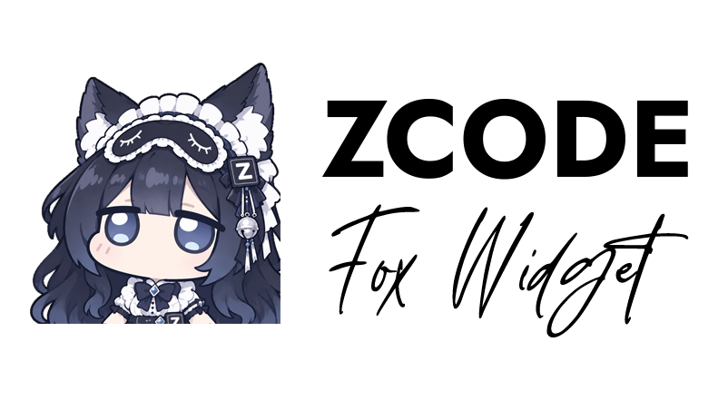
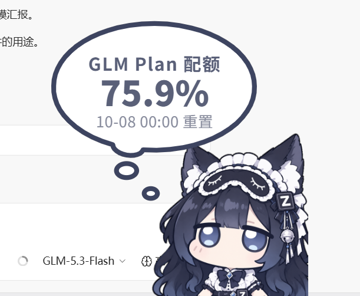

# ZCode狐娘小挂件（zcode-fox-widget）

<div align="center"></div>

> 产品名 **ZCode狐娘小挂件**（英文名 ZCode Fox Widget；更名前曾以「ZCode 版 DeepSeek 余额小鲸鱼挂件」「Widget of ZCode」发布）。在 ZCode 里常驻一位小狐娘（可一键切回原版小鲸鱼，或上传任意形象）：显示 **DeepSeek 余额**、**GLM Plan 剩余配额**、**CommandCode 三重额度**（月度池 + 5 小时/周窗口，多账号池）、**各厂商今日已用**（八家价目 + 34 个厂商模板、缓存/峰谷分档计价）、**当前峰谷时段**，每轮对话结束还会弹一个气泡告诉你 **上一轮花了多少钱 / 占了多少配额**。
>
> 它浮在 ZCode 窗口的右下角，跟着窗口移动/最小化/关闭，指针不在它身上时点击直接穿透到下面的应用——**不挡任何操作**；开「桌宠模式」后以整个屏幕工作区为家，切应用也不隐身，一直浮在最上层。

---

## 移植关系与协议

**本项目不是原创，是移植版的延续。** 视觉与交互设计、鲸鱼素材、音效、台词、峰谷定价表和计费口径来自上游项目：

| | |
|---|---|
| **原版** | [MeteorNOX/DeepSeek-Balance-Whale-Widget](https://github.com/MeteorNOX/DeepSeek-Balance-Whale-Widget)（MIT，Copyright (c) 2026 MeteorNOX）——DSH（DeepSeek Harness）的 Web 插件 |
| **ZCode 移植** | [nb10yyds/zcode-whale-widget](https://github.com/nb10yyds/zcode-whale-widget)——ZCode 没有上游依赖的脚本注入与凭据服务扩展点，宿主适配层（本地服务、凭据发现、每轮消耗数据源、平台集成）为移植期重写；挂件本身的观感与算法追求与上游一致 |
| **本仓库** | fork 自上址（基线 e60e09c），v1.1.0–v1.8.4 在移植版上继续开发 137 个提交，v1.8.5 起以「ZCode狐娘小挂件」独立建仓维护 |

**沿用自上游**：`assets/` 下上游素材（鲸鱼形象、`rua.gif`、两套音效）、气泡 SVG 几何、字号档、动画参数、拖拽/四分吸附/左吸附镜像/alpha 命中检测、随机台词六组的文案与权重、峰谷定价表与时段规则、记账模式语义、余额接口取项规则。

**新增素材（非上游）**：`GLM.png`（小狐娘）、`gpt.png`（GPT娘）、`kimi.png`（kimi娘）、README 头图 `fox.png` —— 均为项目自有素材；`xiaoke.png`（小克）取自 [aklnaaw/dsh-xiaoke-widget](https://github.com/aklnaaw/dsh-xiaoke-widget)（MIT），**已获原作者授权**，并按本仓库角色的画布规格等比归一化（内容高度约 98%、底/右对齐），与其余内置形象观感一致。

**移植期重写**：本地服务 + 独立页面 + 桌面浮层的呈现层；三级凭据发现链；每轮消耗改读 ZCode 落库的 `turn_usage`；MCP 服务、SessionStart 自启 hook、skill、`/fox` 命令与 CLI；出站白名单与本地服务加固。

逐条清单见 [`NOTICE`](./NOTICE)；MIT 许可全文见 [`LICENSE`](./LICENSE)。fork 之后新增了什么，见下一节与 [CHANGELOG](./CHANGELOG.md)。

---

## 功能总览（基础功能）

- **余额**：来自 `https://api.deepseek.com/user/balance`。
- **今日已用**：主口径固定**本机库**——读 ZCode 落库的每轮模型用量、按各厂商价目折算，按模型看得见、不受充值干扰；**小鲸鱼记账 / 实时·令牌**退居「对账 + 兜底」（详见「数据与计价口径」）。
- **每轮对话消耗**：读取 ZCode 记录的每轮真实 token 用量，换算金额后弹出红色金额气泡（自动关闭秒数可设，填 0 表示手动关闭），可逐档核对明细；订阅套餐轮显示「本轮消耗余额: x%」而非虚构金额。
- **余额与额度**：DeepSeek 走内置余额接口；**GLM Plan 剩余配额**（零密钥，尾随客户端日志）；**CommandCode 三重额度**（月度 credit 池 + 5 小时/周滚动窗口，多账号池）；另有 **34 个厂商模板**（含 Kimi Coding / MiniMax Coding / OpenCode Go 等订阅窗口，以及 OpenAI / Anthropic / Gemini / 硅基流动 / 火山方舟 等 19 家「官方没有 API key 查余额」的厂商——这类只报凭据状态，金额走本机 token 用量）。有官方余额接口的厂商（Kimi/Moonshot 等）的余额会随气泡小字显示（v1.8.8）。
- **记账二级页**：一级菜单有「**用量记录…**」（v1.8.7 移回一级）与「**=角色名记账=**」入口；额度预警、余额预警、余额校正收进记账页。
- **预警**：一条「额度%」阈值对 GLM Plan 与 CommandCode 同时生效，加一条「余额¥」管 DeepSeek 余额见底；每源每天最多提醒一次，恢复后自动重新武装。
- **桌宠模式**（浮层专属）：开启后挂件以**整个屏幕（工作区，自动排除任务栏）**为界面，可拖出 ZCode 窗口放到屏幕任何角落，且锁在所有窗口最上层——切到别的应用、ZCode 被盖住或最小化也不隐身；关闭后回到「跟随 ZCode 窗口」的原有行为。
- **挂件交互**：拖拽、四边四分之一吸附、左吸附水平镜像（文字保持可读）、按压 Q 弹 + 音效、余额变化数字滚动、点击角色弹气泡、再点切随机台词（含 rua 动图；台词按内置角色分套——小鲸鱼 = 原版文案也是默认套，小狐娘 / GPT娘 / kimi娘 / 小克 各有一套专属台词，用户导入的角色用鲸鱼套；切角色当场换台词，不用刷新页面）。
- **汉堡菜单**：大小 0.6–2.5×、音效、音量、角色、对账口径、峰谷播报、主题（跟随 ZCode / 浅色 / 深色）、显示、气泡开关、按压泡泡、每轮消耗提示与自动关闭秒数、避让滚动条，浮层下还有「桌宠模式」与「跟随延迟」。
- **会话自启**：打开 ZCode（新会话）时自动拉起，不用手动开。
- **随窗口联动**：ZCode 移动/缩放时跟着走，最小化或被别的应用盖住时隐藏（除非开了桌宠模式），ZCode 退出时一起退出。

---

## 相对原项目的新增与优化

以上是「一只挂件」的基础能力；下面是 fork 之后（v1.1.0 – v1.8.5）在移植版基础上重点建设的部分，逐版本的完整说明见 [CHANGELOG](./CHANGELOG.md)。

### 计费与额度体系

- **多厂商计价内核**（v1.1.0/v1.2.0）：从上游仅 DeepSeek 峰谷扩展为八家价目（DeepSeek/GLM/OpenAI/Claude/Qwen/MiniMax/MiMo/Kimi，含 272K 整单取档等各家官方口径），并立下「未知模型只计 tokens、不套别家价」的红线；后续持续补齐 GPT-6 系列、GPT-5.6-cyber 与 Kimi 全系条目（v1.7.6/v1.7.7）。
- **GLM Plan 套餐配额**（v1.1.0 引入，零密钥）：尾随客户端日志读套餐剩余，配套一整套鲁棒性修复——空桶快照跳过（v1.7.8）、日志尾窗逐级扩读与死套餐残值过滤（v1.4.2）、stale 观测标注（v1.4.1）。
- **CommandCode 三重额度 + 多账号池**（v1.7.8–v1.7.10，v1.8.3/v1.8.4 打磨）：月度 credit 池 + 5 小时/周滚动窗口，直读网关 API；反代凭据现读不落盘、兼容两种凭据形状；多账号「最近使用优先、全撞墙时最早解锁兜底」；额度气泡卡（三窗口条 + 绑定约束窗口倒计时 + 账号池健康度）；对网关 `limited` 粘滞标志的正确解读（需佐证才采信，升级套餐后健康账号不再被误判限流）。
- **今日已用口径重排**（v1.7.0）：主口径改本机库，充值当天不再归零；记账/实时·令牌退居「对账 + 兜底」；用量记录的模型排名给订阅套餐行按等价市值参与排序（v1.7.5，`≈¥` 标注、不虚报真金白银）。
- **预警体系演进**（v1.3.0 → v1.7.7 → v1.8.0）：余额预警合并 → 取消消费型预警（语义回归「见底」）→ 泛化为「额度% + 余额¥」每源一条，旧配置键自动迁移。
- **34 个厂商模板**（v1.1.0 首批 7 家 → v1.8.0 对齐上游 34 家）：订阅窗口类 + 19 家无余额接口厂商只报凭据状态；模板必须显式声明 `host`，白名单 fail-closed。
- **价目复核纪律**（v1.4.3 起）：`fox-pricing-review` 技能把「官方页核对 + LiteLLM 交叉验证 → 改表 → 改钉死断言 → 发版」固化为手动流程，本项目没有自动价目更新。

### 桌宠与窗口行为

- **桌宠模式**（v1.8.0 引入 → v1.8.1 重定义 → v1.8.2 贴顶）：视口 = 整个工作区、失焦不隐身、丢了置顶才重申；纵向钳制按命中画布**实测的角色不透明内容**计算，角色能真正拖到屏幕顶（气泡自动避让）。
- **冻结防线**（v1.3.3 → v1.8.1，v1.8.6 精简）：禁用原生遮挡计算、首帧上屏、60 秒出帧保险、DPI 变更自动重建、显隐走透明度切换、视口钳到窗口交集——这套**被动防线**保留；主动的「活性点 + DXGI 桌面像素对账」检测（v1.4.2–v1.8.5）于 v1.8.6 移除：窗口拖动时采样链路时序错位会误报冻结（可见的闪烁）、检测点本身在拖动中滞后可见，而它能覆盖的场景被动防线已兜住（真冻结最迟 60 秒自愈，或 `node lib/cli.mjs window restart` 一键重建）。
- **跟随引擎**（v1.3.1 → v1.5.3 → v1.8.1）：探测循环编译成 C#（40ms 档端到端 13ms、稳态 CPU ≈0.16% 单核），5/16/40/100/250ms 挡位实测表；跟随目标选目标进程**面积最大的可见窗口**（绕开 MainWindowHandle 陷阱）；pid 身份门控，重开 ZCode 不再在加载动画里冒头。
- **点击无响应根除**（v1.3.2/v1.4.3）：隐藏→重现改透明度切换，不再拆原生输入管线；输入复活改纯样式翻转。
- **不可激活窗口**（v1.3.0）：与挂件互动不抢 ZCode 前台（`WS_EX_NOACTIVATE`）；指针按到输入类控件才临时接管键盘焦点，离开即交还。
- **渲染节流三重防线**（v1.8.2）：三个 Chromium 后台化开关 + 页面侧帧调度逃生门（300ms 排不上一帧就整体关过渡）——二级面板在任何遮挡/节流环境下必然可见。

### 交互与个性化

- **按压泡泡**（v1.5.0–v1.5.3）：移植 DSH 自定义泡泡——点击队列 + 可选模块（文本占位符 / 随机语句 / 内置视图）+ 实时预览的两窗编辑器；点文本框冻结 ZCode、任务栏幽灵按钮两个深水 bug 根治。
- **内置形象库**（v1.2.0 起默认小狐娘；v1.7.4 台词分套；v1.8.2 台词修订）：内置 **小狐娘 / 小鲸鱼 / GPT娘 / kimi娘 / 小克** 五个形象，台词按角色分套（小狐娘 / GPT娘 / kimi娘 / 小克 各有一套专属台词，小鲸鱼那套是默认套、用户导入的角色也用它）；角色可导入、改名、删除，内置形象可隐藏找回（v1.3.0/v1.6.0）。
- **音效库**（v1.6.0）：导入 1–2 个自定义音效（按压/松手）、逐行删除、回落内置。
- **隐藏菜单按钮**（移植自 DSH）：菜单里可开「隐藏菜单按钮」——开启后挂件上的菜单按钮不再出现（悬停也不显形），改用**右键点击角色**唤出菜单，菜单位置与点按钮时完全一致（按钮仍在布局里作锚点）；关闭即恢复。设置随 `widget-state` 持久化。
- **主题**（v1.2.0/v1.6.0/v1.7.2）：深色取自 ZCode 实测 token；「跟随 ZCode」三层判定（DWM 暗色标志观测 > 配置 > 系统），ZCode 里换主题 10 秒内跟变。**角色专属配色**：气泡的描边与文字按角色换色（浅/深两档）；**浅色模式下一整套界面**——设置按钮与菜单、二级页面（按压泡泡设置 / 记账 / 用量记录，含次级文字）、文本框、下拉列表、复选框、拖动条——都跟随该角色的浅色档色值（深色档不跟，保持主题中性）。
- **气泡体验**：额度卡与台词互斥收口（v1.7.11/v1.8.0）、逐行缩字自适应（v1.4.0）、峰谷/重置芯片（v1.5.2）、99.5% 一位小数与「已限流」准确表达（v1.8.3）。

### 平台集成与工程质量

- **UI/UX 专项**（v1.7.3 + v1.8.0）：15 项 + 22 项审查清零——失败态状态机、遮挡叠层、格式与圆角/动效 token 化、对比度达标、焦点环、`prefers-reduced-motion`。
- **接口诚实化**（v1.3.1）：CLI/MCP 金额按真实币种输出；MCP 版本号单一来源；发现缓存 TTL。
- **可观测性**：浮层黑匣子日志常开（v1.4.3，超 5MB 轮转）、`/whale/health` 带凭据探测明细。
- **质量面**：`tools/selftest.mjs` 端到端自检（计价口径/账本/账号池/降级路径）、`tools/smoke-ui.mjs` CDP 真机回归（headless 浏览器驱动真实页面）；Conventional Commits 与版本发布纪律成文（[CONTRIBUTING](./CONTRIBUTING.md)）。
- **安全**：出站主机白名单与地址校验、厂商模板显式 `host` 声明、本地服务 Host/Origin 校验与关闭令牌、本地威胁模型显式化（v1.7.1）、子进程 `shell:false` 加固。

---

## 显示方式：桌面浮层（推荐）

一个独立的 Electron 窗口：透明、无边框、不进任务栏、始终置顶，**覆盖 ZCode 窗口范围但默认鼠标穿透**——只有指针压到鲸鱼、气泡或菜单上时才接管鼠标，其余位置的点击照常落到下面的 ZCode。装好运行时后打开 ZCode 就会自己出现，**不用浏览器、不用手动开任何东西**。

长这样：



### 本地页面地址（备用 / 排障入口）

浮层加载的本来就是一个网页——同一个服务把同一个页面也挂在 `http://127.0.0.1:<port>/`，浏览器打开它看到的是**同一只鲸鱼、同一份 `lib/widget.js`、同一份配置**，不是第二套实现。平时不用关心它：服务随会话自启，浮层的显示与交互走的就是这个地址。

会用到它的只有两种情况：

- **排障**：浮层里输入框打不了字、或浮层行为可疑时，用浏览器打开这个地址直接操作，快速区分「页面逻辑的问题」还是「浮层窗口层的问题」（排查表见 skill 的「故障排查」一节）。
- **非 Windows**：浮层依赖 Win32 窗口 API，macOS / Linux 上只有这个页面形态可用。

`<port>` 默认 39321（被占用会顺延），以 `node lib/cli.mjs start` 的输出或 `~/.zcode/whale/server.json` 里的 `url` 为准；服务只监听 `127.0.0.1`，本机之外访问不到。

---

## 安装

### 前置条件

- ZCode 客户端（插件系统）
- Node.js（用于运行插件自带的脚本）——ZCode 通常已自带，命令行里 `node -v` 能跑即可
- Windows（桌面浮层依赖 Win32 窗口 API；macOS / Linux 只能用本地页面）

### 步骤

1. **把仓库克隆到一个固定位置**（不要放在会被清理的临时目录）：

   ```bash
   git clone https://github.com/pigeon189/zcode-fox-widget.git ~/.zcode/plugins/zcode-fox-widget
   ```

   后面的命令都假设你在仓库根目录下执行。

2. **注册为本地插件市场**，二选一：

   **方式 A：客户端界面**
   设置 → 插件管理 → **发现** → 右上角 `+` → 选择**本地目录**，指向仓库根目录（内含 `marketplace.json`）。

   **方式 B：手工写配置**
   在 `~/.zcode/cli/plugins/known_marketplaces.json` 的 `marketplaces` 数组里追加：

   ```json
   {
     "id": "zcode-fox-local",
     "source": { "source": "directory", "path": "<仓库绝对路径>" },
     "name": "zcode-fox-local",
     "description": "Local marketplace for ZCode狐娘小挂件 (zcode-fox-widget).",
     "pluginCount": 1
   }
   ```

   > 想把这份插件分享给别人从 GitHub 安装，把 `source` 换成仓库形式即可：
   > `"source": { "source": "github", "repo": "pigeon189/zcode-fox-widget" }`

3. **安装并启用插件**：在插件管理里安装 `zcode-fox-widget`。手工方式则在 `~/.zcode/cli/config.json` 里写：

   ```json
   {
     "plugins": {
       "enabledPlugins": {
         "zcode-fox-widget@zcode-fox-local": true
       }
     }
   }
   ```

4. **重启会话**（或重开 ZCode），让 MCP 服务与 hook 生效。

5. **想用桌面浮层的话，再装一次它的运行时**（约 150MB，一次性；只装到数据目录，不进仓库）：

   ```bash
   node lib/cli.mjs desktop install
   ```

装好后打开 ZCode，鲸鱼会自己出现。

### 更新

插件的安装来源就是这份克隆的仓库，更新 = 拉新代码 + 让客户端重抓一遍：

1. 在仓库目录里 `git pull` 拿到最新版（每次发版 `.zcode-plugin/plugin.json` 与 `marketplace.json` 的版本号都会同步递增，这是客户端判断「有新版本」的依据）。
2. 设置 → 插件管理 → 对 `zcode-fox-local` 市场重新抓取（或移除后重新添加），新版本会装进独立的缓存目录（`cache/zcode-fox-local/zcode-fox-widget/<版本>/`）。
3. 重启客户端生效。

说明：挂件的全部数据（API key、账本、角色、泡泡配置、Electron 运行时）都在 `~/.zcode/whale/`，与插件目录无关，更新不丢配置；更新后旧的版本缓存目录如未自动清理，关掉客户端后手动删除即可。

---

## 首次配置

### API Key（通常不用配）

余额接口需要一个 DeepSeek API Key。按以下顺序自动查找，**大多数情况第一条或第三条就能命中，无需配置**：

1. 环境变量 `DEEPSEEK_API_KEY`
2. 插件配置 `~/.zcode/whale/config.json` 的 `apiKey`
3. **ZCode 客户端里已配置的 DeepSeek provider**（`baseURL` 指向 `api.deepseek.com` 的那一项）

写入方式（任选其一）：

```bash
node lib/cli.mjs key sk-xxxxxxxxxxxxxxxx     # 写进插件配置
```

或让 ZCode 里的模型直接调 MCP 工具 `whale_config`（`action=set`, `apiKey=...`）。

密钥只在本机内存中使用，只发往 `api.deepseek.com` / `platform.deepseek.com`，不写日志、不打印明文（对外只显示 `sk-04…994` 这样的掩码）。

### 关掉不想要的自动化

`~/.zcode/whale/config.json`：

| 字段 | 默认 | 作用 |
|---|---|---|
| `autoStartWidget` | `true` | 会话启动时自动拉起挂件服务 |
| `autoStartOverlay` | `true` | 会话启动时顺便拉起桌面浮层 |
| `followIntervalMs` | `40` | 跟随探测间隔（毫秒），菜单里的选择会覆盖它 |
| `port` | 自动（39321） | 固定端口，被占用时自动顺延 |

改完重启会话生效。

---

## 使用指南

### 打开 ZCode 就自动出现

插件自带 SessionStart hook，**每次会话启动都会幂等拉起**（已在跑就复用，不会重复开）。确认方法：

```bash
cat ~/.zcode/whale/autostart.log      # 每次启动追加一行，如 server=started overlay=reused
```

> SessionStart 是在**会话启动**时触发的。正常情况下打开 ZCode 会恢复/创建会话，所以碰不到边界情况。

### 命令行

```bash
node lib/cli.mjs status          # 余额 + 今日已用 + 挂件服务与桌面浮层状态
node lib/cli.mjs turn            # 上一轮对话消耗（含逐档明细）
node lib/cli.mjs start / stop    # 启停挂件服务（浮层与本地页面共用同一个）
node lib/cli.mjs window start    # 启动桌面浮层（浮在 ZCode 界面上）
node lib/cli.mjs window stop     # 关闭浮层
node lib/cli.mjs window status   # 浮层与运行时状态
node lib/cli.mjs desktop install # 安装 Electron 运行时（仅浮层需要，一次性）
node lib/cli.mjs key sk-...      # 写入 API Key
node lib/cli.mjs mode ledger|token  # 切换对账口径（小鲸鱼记账 / 实时·令牌）
node lib/cli.mjs json            # 结构化输出，便于脚本消费
```

### 在对话里直接用

- 输入 `/fox`（或 `/fox turn`、`/fox window start`、`/fox key sk-...`）
- 或者直接问「我还有多少余额」「上一轮花了多少」，ZCode 会调用 MCP 工具：

| MCP 工具 | 作用 |
|---|---|
| `whale_balance` | 余额、今日已用、当前峰谷时段 |
| `whale_last_turn` | 上一轮消耗金额与逐档明细 |
| `whale_widget` | `start` / `stop` / `status` / `url`，以及浮层的 `overlay_start` / `overlay_stop` / `overlay_status` |
| `whale_config` | 查看或修改配置（API Key、对账口径、端口、自启、跟随间隔） |

### 挂件菜单

悬停鲸鱼 → 右上角出现三点按钮 → 点击打开菜单：

| 项 | 说明 |
|---|---|
| 大小 | 0.6–2.5×，滑块或数字（1–20） |
| 音效 / 音量 | 内置小黄鸭/音效1，可导入自定义音效（1 个=按压松手共用，2 个=按压+松手）；音量 0 即静音 |
| 角色 | 选择形象（内置：小狐娘 / 小鲸鱼 / GPT娘 / kimi娘 / 小克）；导入的图片可改名（✎）或删除（×）；内置形象也可删（隐藏记在 roles.json 的 hiddenBuiltins，清掉即找回） |
| 对账口径 | 小鲸鱼记账 / 实时·令牌（v1.7.0 起决定「对账 + 兜底」用哪个账号数字，主显示固定本机库） |
| 峰谷播报 | 台词里峰谷文案的风格（默认 / 梁文峰谷 / !?强强?!） |
| 主题 | 浅色模式 / 深色模式 / 跟随 ZCode（三层判定：浮层观测 ZCode 窗口的 DWM 暗色标志 > 配置 ui.theme > 操作系统深浅色） |
| 显示 | 气泡主显示跟随哪个计费源（自动 / Plan / CommandCode / GLM / DeepSeek） |
| 气泡 | 是否允许自动弹出气泡 |
| 按压泡泡 | 自定义按压泡泡队列（DSH 式可视化编辑器：加权变体 / 随机语句带权重与样式 / 内置视图 / 图片与随机图片 / 超链接 / 模块库）；首分区「每轮消耗提示内容」同面板编辑 |
| 每轮消耗提示 | 是否在每轮结束后弹消耗气泡；自动关闭秒数（0 = 手动关）。提示内容在「按压泡泡设置」首分区编辑 |
| 避让滚动条 | 让挂件右侧避开滚动条的像素宽度（默认关） |
| 隐藏菜单按钮 | 开启后挂件上的菜单按钮不再出现，改用右键点击角色唤出菜单（位置不变） |
| 桌宠模式 | **仅浮层**：锁在最上层、切应用不隐身 |
| 跟随延迟 | **仅浮层**：探测 ZCode 窗口位置的间隔，16 / 40 / 100 / 250ms（16ms 为系统定时器粒度下的实际下限） |
| 用量记录 | 今日金额与模型占比、近 7 天逐日、最近 50 条明细（一级菜单；v1.8.0–v1.8.6 曾收进记账页） |
| =角色名记账= | 记账二级页：额度预警 / 余额预警 / 预警内容模板 / 余额校正（原「预警」「余额校正」两行已收编于此） |

### 浮层里的交互要点

- 鲸鱼可以拖到窗口内任意位置，靠边会吸附，贴左缘时整体左右镜像。
- **指针要先落在鲸鱼上，点击才会被浮层接管**——这是穿透设计的必然代价，好处是不会误触。
- 普通交互（按鲸鱼、拖拽、开菜单、点气泡）不会抢走 ZCode 的前台，ZCode 不会因为挂件而停止刷新。
- 菜单里的文本框/下拉**按上去就能打字**：指针按到输入类控件时浮层才临时接管键盘焦点，离开即交还。

---

## 跟随延迟与性能

浮层跟随靠一个常驻探测脚本（`desktop/follow-window.ps1`）读 ZCode 主窗口的位置、大小与前台状态。**默认 40ms 探测一次**，实测端到端跟随延迟约 **13ms**——拖窗口时鲸鱼基本是贴着走的。

之所以能一边跑得勤、一边几乎不吃 CPU，是两点设计：

- **探测循环编译成 C# 运行**（脚本内联 `Add-Type`），不是解释执行的 PowerShell 循环。同样 40ms 间隔，解释执行的循环体本身就吃掉约 3.4% 单核，编译后只剩 **0.16%**。
- **贵的操作单独限频**：枚举进程（`GetProcessesByName`）用来定位 ZCode 主窗口句柄与其 pid 列表，按 3 秒预算刷新；「前台是不是浮层自己」不再靠进程名枚举，而是比对主进程传入的浮层 pid（v1.3.1 起，见上）。每个探测周期只做几个微秒级的 Win32 调用，且**只有状态真的变化才输出**。

实测对照：

| 探测间隔 | 端到端跟随延迟 | 探测进程 CPU（单核占比） |
|---|---|---|
| 40ms（默认） | 13ms | 0.16%（稳态） |
| 250ms | 135ms | 探测次数少 6 倍，只会更低 |

也就是说间隔调小几乎没有性能代价。菜单里改即时生效，不用重启浮层。

---

## 数据与计价口径

### 今日已用

- **本机库（主口径，v1.7.0 起）**：读 ZCode 落库的每轮模型用量、按各厂商价目折算（`lib/usage-records.mjs` 的 `todayVendorUsage()`，与用量记录面板同一次聚合）。按模型看得见、不受充值干扰；套餐/网关行按配额或 tokens 表达，不折算虚构金额。
- **小鲸鱼记账（对账 + 兜底）**：靠"观测到的余额下降"累计，覆盖该 DeepSeek 账号的全部花费（含其它设备/其它 key），服务未运行期间产生的消耗会漏记（从下次观测的新基准开始）。不需要额外令牌。与本机库数字不一致时两口径并排展示（气泡小字 / 用量面板「对账（DeepSeek）」行）；本机库当天无记录时兜底为主显示并标注来源。充值当天该口径会归零（余额上涨记为「待核对调整」），用菜单「余额校正」记一笔即可对上。
- **实时·令牌（对账 + 兜底）**：需要 `DEEPSEEK_PLATFORM_TOKEN`（平台会话令牌，不是 API Key）。令牌会过期，过期后自动回落记账口径。

### 每轮消耗

按 ZCode 记录的 token 分档计价：**缓存命中**走「命中」价、**未命中输入**走「未命中」价、**缓存写入**走「缓存写」价（DeepSeek 与未命中同价、GLM 限时免费记 0、Kimi 按 TTL 档、Claude/Qwen 1.25×输入，以各家官网为准）、**输出与思考**走「输出」价；DeepSeek 再按该轮所处时段选高峰或谷价，其余厂商平价。档位一律「整单取档」（档位由单次请求输入 token 总量决定，与 OpenAI/阿里云/MiniMax 官方口径一致）。金额按币种分列（¥/$ 不混加）；未维护价目的模型只计 tokens，不折算金额。

> **一个必须注意的口径**：ZCode 记录的 `input_tokens` 是**含缓存的总输入**（实测 `computed_total_tokens = input + output` 且 `input ≥ cache_read`）。计价前必须减掉命中部分，否则缓存那 99% 会被按未命中价重复计费——实测同一轮会从 ¥3.05 虚高到 ¥76.95（约 25 倍）。代码用 `lib/pricing.mjs` 的 `splitInputTokens()` 统一处理，并用总量字段自动识别 Anthropic 那种「input 不含缓存」的口径。`tools/selftest.mjs` 里有针对两种口径的回归断言。

想核对每一分钱，用 `node lib/cli.mjs turn`，它会逐档列出：

```
上一轮对话消耗   ¥ 1.33
模型             deepseek-flash
计价时段         空闲（base 价目）
缓存命中输入     22,637,312 tokens × ¥0.05/M = ¥1.1319
未命中输入       12,049 tokens × ¥1.5/M = ¥0.0181
输出             40,034 tokens × ¥4.5/M = ¥0.1802
```

### 改价目

DeepSeek 调价时改 `lib/pricing.mjs` 顶部的 `PEAK_HOURS` / `BASE_PRICE` / `PRO_PRICE`。`deepseek-v4-pro` 走 3 倍价，其余（含 `deepseek-flash`）走基础价。

---

## 常见问题

| 现象 | 原因与处理 |
|---|---|
| 界面上看不到挂件 | ZCode 客户端不提供界面注入点，必须走桌面浮层：`desktop install` 装运行时，再 `window start` |
| 打开 ZCode 没有自动出现 | 看 `~/.zcode/whale/autostart.log` 最后一行。没有新行说明 hook 没加载（插件未启用，或改完配置后没重启会话）；`overlay=skipped:no-runtime` 说明运行时没装；`overlay=failed:...` 看括号里的原因 |
| 余额显示「未找到 DeepSeek API Key」 | 三条凭据来源都没命中：环境变量 `DEEPSEEK_API_KEY`、`~/.zcode/whale/config.json`、ZCode provider 配置（含数据目录迁移后的 `$ZCODE_DATA_BASE_DIR/.zcode/v2/provider_config.json`；规则没写 baseUrl 时端点从 zcode-builtin 模板继承）。错误文案带探测摘要，逐条明细看 `/whale/health` 的 `keyProbe`（会标明本地网关/加密凭据为何被跳过）。也可用 `key` 子命令写入 |
| 点击挂件/气泡没声音 | 检查菜单音量是否为 0、音效组是否已选；音频在页面加载时预热，系统输出设备切换后若无声，重启浮层即可。按压音只对「按鲸鱼」和「点气泡」发声，菜单按钮刻意不出声 |
| 点设置键却有音效 / 点挂件没音效 | v1.3.0 起菜单按钮不再出声；鲸鱼与气泡的按压音依旧。若点鲸鱼完全没声音，先确认菜单音量不为 0 |
| **和挂件互动后 ZCode 画面卡住，点一下 ZCode 才恢复** | v1.3.0 已修：浮层窗口改成不可激活，不再抢走 ZCode 的前台（此前 ZCode 失去前台即停止刷新）。若仍复现，检查浮层是否为旧版本（`window status` / `/whale/health` 的 version） |
| 浮层里菜单的数字框打不了字 | v1.3.0 起按上去就能打字（浮层在指针落到输入类控件时临时接管键盘焦点）。若仍不行，检查是否在用旧版浮层 |
| 切了模型气泡还是旧源 | 自动跟随 3 秒轮询一次输入框选择；选择读不到时回落最近一次真实模型调用。菜单「显示」手动锁定可立即切换 |
| 余额显示旧值并带 `stale` | 接口瞬时失败（网络/5xx），服务在回退缓存；4xx 不会回退，会直接报错 |
| 今日已用一直是 0 | 主口径是本机库：ZCode 今天还没有模型用量记录（或数据库读不到）时，才兜底显示账号口径并标注来源；账号口径（小鲸鱼记账）只统计观测到的余额下降。用 `node lib/cli.mjs status` 看双口径、`/whale/health` 看数据来源 |
| 每轮消耗不弹窗 | 需要 ZCode 至少完成过一轮对话（`turn_usage` 有 `completed` 行）；另外菜单里「每轮消耗提示」必须开着 |
| **每轮消耗金额离谱（虚高十几倍）** | 计价口径踩了「input 含缓存」的坑。核对 `splitInputTokens()` 是否被 `costOfUsage()` 使用，并跑 `node tools/selftest.mjs`；用 `cli.mjs turn` 看逐档明细即可判断 |
| 鲸鱼不跟着 ZCode 走 | 探测脚本可能挂了：`window stop` 后 `window start` 重建。开 `WHALE_DEBUG_PORT` 启动会把判断依据写进 `~/.zcode/whale/overlay-debug.log` |
| 跟得不跟手 / 想更省资源 | 菜单「跟随延迟」即时切换 5/16/40/100/250ms（改完不需重启浮层），或写 `config.json` 的 `followIntervalMs`。默认 40ms 实测端到端延迟约 13ms、稳态 CPU 约 0.16% 单核；5ms 档实测 CPU 同量级（≈0.26%）但实际周期 ≈11ms（受定时器量子限制），详见 CHANGELOG 的 v1.8.1 小节实测表 |
| 浮层里点不动鲸鱼 | 指针要先落在鲸鱼上（光标变 `grab`、右上角出现菜单按钮）；若整块区域都点不动，检查是否被其它置顶窗口压住 |
| 浮层启动失败 | `cli.mjs window status` 看运行时是否已装 |
| 峰谷判定不对 | 看 `lib/pricing.mjs` 的 `PEAK_HOURS` 等常量；工作日高峰为北京时间 9–12、14–18，2026-08-23 起周末全天谷价 |
| 换了图片/音效不生效 | 资产路由每次读盘且 `no-store`，强刷即可；确认替换的是 `assets/` 下的同名文件 |
| Plan 剩余配额不显示 / 提示「Plan 日志未找到」 | 多半是数据目录迁移后的机器在**普通终端**里手动跑服务：没有 `ZCODE_DATA_BASE_DIR`，只会在 `~/.zcode/v2/logs` 下找日志（旧目录可能只剩迁移前的残留）。由 ZCode 进程拉起的服务不受影响；终端调试请先设置该变量。`/whale/plan.json` 的 `no-plan-log` 响应带 `probedDirs`（实际探测了哪些目录、各目录最新日志是哪天），照着看即可 |
| CommandCode 额度读不到 / 卡片说「未找到反代凭据」 | 凭据是**现读**反代本地配置 `~/.cmdgo-bridge/credentials.json`（只支持本机反代），不在环境变量里；反代没跑或该文件不存在时就是这个提示。v1.7.9 起兼容两种凭据形状（纯字符串与 `{value,source}` 对象）。`cmdgo-bridge` 换过数据目录时用 `CMDGO_DIR` 指过去 |
| CommandCode 额度卡显示「已限流」 | 网关的 `exceeded` 或已用 ≥100%：某一窗口到顶，补满前不可用。卡片最下面那行是**绑定约束**窗口的重置时间（多窗口同时撞墙时报最晚的那个，早重置的不解锁）；「账号池已全部限流」= 所有账号都没额度了 |
| CommandCode 额度卡/气泡里出现 $ 之外的换算疑虑 | credit 池以美元计价，而「今日已用」按各厂商本币价目折算，多币种日是**等价口径**而非账单口径（见「数据与计价口径」） |
| 开了桌宠模式后鲸鱼可以在整个屏幕上拖 | 这就是桌宠模式（v1.8.1）：界面 = 整个工作区（自动排除任务栏，任务栏在哪条边都成立）+ 失焦不隐身 + 锁在最上层。关掉即回到「跟随 ZCode 窗口」 |
| 挂件每隔几秒消失再出现一次 | 旧版冻结检测误判循环（v1.8.1 修过一轮）；v1.8.6 起「活性点 + DXGI」检测整体移除，该类误判不复存在。画面若真冻结（页面活着、屏幕停旧帧），最迟 60 秒出帧保险自愈，或 `node lib/cli.mjs window restart` 立即重建 |
| 想要小鲸鱼那张原版脸 | v1.8.1 已回滚「小鲸鱼蓝白」主题（与浅色主题重复）；形象仍可在菜单「角色」切换 |

---

## 自助排查工具

> 运行环境：Node >= 22.5（依赖内置 `node:sqlite`）。`server.json` 含关停令牌，POSIX 下以 0600 落盘；Windows 靠用户目录 ACL 限制其他用户读取。

```bash
node tools/selftest.mjs        # 计价口径回归 + 每轮消耗链路端到端自检（不碰真实数据）
node tools/smoke-ui.mjs        # 前端冒烟：headless Edge/Chrome + CDP 跑真实页面（气泡 hint、displayMode 持久化）
node tools/demo.mjs            # 用假数据起一个服务并周期性产生新轮次，用于观察消耗气泡
node tools/debug-overlay.mjs   # 连进浮层页面（需以 WHALE_DEBUG_PORT 启动）排查渲染/交互
```

---

## 架构

```
zcode-fox-widget/
├─ .zcode-plugin/plugin.json   插件清单：commands / skills / hooks / mcpServers
├─ marketplace.json            本地市场声明，便于在客户端添加
├─ hooks/hooks.json            SessionStart 自启
├─ commands/fox.md             /fox 命令
├─ skills/zcode-fox-widget/    使用与排查说明（供 ZCode 内的助手阅读）
├─ desktop/                    桌面浮层
│  ├─ main.cjs                 Electron 主进程：透明置顶窗口、穿透切换、视口转发、启动门控
│  ├─ preload.cjs              向页面暴露 setInteractive / onViewport / 跟随间隔 / 窗口失焦事件
│  ├─ follow-window.ps1        常驻探测 ZCode 窗口位置/前台/暗色标志（C# 内核，纯 ASCII）
│  ├─ ui-ready.cjs             从客户端日志判定 ZCode 本次启动是否就绪（启动门控）
│  └─ package.json             浮层入口包声明（Electron 启动用）
├─ lib/
│  ├─ server.mjs               本地 HTTP 服务：页面、图片、音效、全部 JSON 接口
│  ├─ widget.js                前端挂件：拖拽/吸附/翻转/菜单/气泡/音效/穿透
│  ├─ balance.mjs              余额、记账账本、平台用量、缓存与回退、今日已用口径合并
│  ├─ usage-records.mjs        用量记录聚合：model_usage 折价、今日/近 7 天、双口径排名、厂商汇总
│  ├─ turn-cost.mjs            每轮消耗（读 turn_usage，回退模型 I/O 日志）
│  ├─ pricing.mjs              八家价目 + 峰谷时段判定 + token→金额（含输入口径拆分）
│  ├─ source.mjs               计费源判定（provider/model/baseURL → Plan / DeepSeek / 按量厂商）
│  ├─ plan-balance.mjs         GLM Plan 配额（尾随客户端日志）与轮级套餐百分比
│  ├─ cmdgo.mjs                CommandCode 三重额度（月度池 + 5 小时/周窗口，网关 API 直读）
│  ├─ vendors.mjs              厂商余额/配额模板框架（host 白名单、缓存、归一化）
│  ├─ discover.mjs             厂商凭据自动发现（多路径扫描 + 短 TTL 缓存）
│  ├─ zcode-theme.mjs          「跟随 ZCode」主题三层判定（观测 > 配置 > 系统）
│  ├─ paths.mjs                数据目录与文件路径常量（含数据目录迁移候选探测）
│  ├─ credentials.mjs          凭据发现 + 出站主机白名单校验
│  ├─ service.mjs              挂件服务的发现/拉起/关闭
│  ├─ overlay.mjs              浮层的启停与 Electron 运行时按需安装
│  ├─ autostart.mjs            SessionStart 自启入口
│  ├─ cli.mjs                  命令行入口
│  └─ mcp-server.mjs           MCP 工具
├─ tools/                      自检、演示与排查脚本
└─ assets/                     鲸鱼形象、rua 动图、两套音效（来自上游）
```

### 运行时数据

都在 `~/.zcode/whale/`，与仓库完全分离：

| 文件 | 内容 |
|---|---|
| `config.json` | API Key、平台令牌、厂商 key（vendorKeys）、端口、自启开关、跟随间隔 |
| `widget-state.json` | 挂件外观与菜单开关（大小、音效、主题、气泡、对账口径、预警阈值、排名口径…） |
| `bubble-content.json` | 按压泡泡队列（v2：`{v:2, tapAdvance, steps:[{modules}]}`；旧 v1 配置读取时自动迁移） |
| `roles.json` + `roles/` | 导入的角色索引与图片；`hiddenBuiltins` 记录被删（隐藏）的内置形象，清掉即找回 |
| `sounds/` + `sounds.json` | 导入的音效文件与索引（≤20 套，v1.6.0 起） |
| `usage-ledger.json` | 记账口径的账本（含最近 30 天归档） |
| `turn-seq.json` | 每轮序号持久化（服务重启后续号） |
| `zcode-theme-observed.json` | 浮层观测到的 ZCode 窗口暗色标志（「跟随 ZCode」第一层；浮层干净退出即删、读取端 24h TTL） |
| `server.json` | 挂件服务运行信息（pid / 端口 / 关闭令牌，0600） |
| `overlay.json` | 浮层进程 pid |
| `overlay-debug.log` | 浮层黑匣子日志（常开，超 5MB 轮转） |
| `autostart.log` | 每次会话启动的自启结果 |
| `desktop-runtime/` | Electron 运行时（约 370MB，删掉即回收，浮层随之失效） |

服务接口（排查时可直接 curl）：页面与资产 `/`（`/index.html`）、`/whale/widget.js`、`/whale/image.png`、`/whale/rua.gif`、`/whale/sound/press.mp3` 与 `/whale/sound/release.mp3`（`?set=<音效集 id>`）；状态查询 `/whale/health`、`/whale/balance.json`、`/whale/plan.json`、`/whale/cmdgo.json`（CommandCode 三重额度，`?refresh=1` 强制绕缓存）、`/whale/vendors.json`、`/whale/usage-records.json`、`/whale/session.json`、`/whale/last-turn.json`、`/whale/sounds.json`、`/whale/roles.json`、`/whale/bubble-content.json`（GET/POST）、`/whale/balance-adjustments.json`（GET/POST）、`/whale/size.json`（GET/PUT）、`/whale/zcode-theme.json`；写操作 `/whale/role-upload.json`、`/whale/role-rename.json`、`/whale/role-delete.json`、`/whale/sound-upload.json`、`/whale/sound-delete.json`（写操作校验 Origin）；关停 `/whale/shutdown`（需 `server.json` 随机令牌）。

---

## 安全说明

- **出站白名单**：只向 `api.deepseek.com`、`platform.deepseek.com` 发请求；发请求前校验协议、主机名，拒绝环回/私有/保留地址的字面量 IP。要扩展目标需改 `lib/credentials.mjs` 的 `ALLOWED_HOSTS`。
- **本地服务**：只监听 `127.0.0.1`；校验 `Host` 头防 DNS rebinding；写操作校验 `Origin` 防跨站伪造；停止服务需要 `server.json` 里的随机令牌；不返回通配 CORS 头。
- **浮层**：只加载本机 `127.0.0.1` 的页面，运行在 `contextIsolation` 下，仅通过 preload 暴露 `setInteractive` / `setViewport` / `quit` / 跟随间隔几个能力，页面没有 Node 权限。
- **凭据**：API Key 只在内存中使用，不落日志、不打印明文。
- 排查用的远程调试端口默认关闭，只有显式设置 `WHALE_DEBUG_PORT` 才打开。

---

## 已知限制

- 浮层仅支持 **Windows**（依赖 Win32 窗口 API 与 PowerShell）；macOS / Linux 上只有本地页面形态可用。
- 浮层跟随靠轮询，拖动时理论上存在约一个探测间隔的滞后（默认 40ms，实测 13ms，肉眼几乎看不出）。
- 浮层里**吸附没有滑动动画**（位置直接就位）。这是为了避开透明窗口的合成层错位——详见下面「踩坑记录」；本地页面（浏览器打开）里动画完整。
- 浮层穿透的必然代价：点击某个位置前，指针得先落在鲸鱼上。
- 菜单里的数字输入框在浮层里建议用箭头/滑块，因为透明浮层窗口默认不抢键盘焦点。
- 菜单默认弹在鲸鱼头顶；鲸鱼被拖到窗口顶部、上方放不下时会翻到按钮下方（两种模式都一样）。
- 每轮消耗只统计 ZCode 自己记录的主对话轮次；ZCode 之外调用的 API 不计入。

### 踩坑记录（写给后来改这份代码的人）

1. **透明窗口不能靠 `setBounds` 贴合别的窗口**。一改尺寸/位置，Windows 合成层不重排，页面内容会被画到偏离窗口的地方（实测页面 `(0,0)` 的方块跑到窗口外）。现在的做法是窗口恒定铺满工作区，把 ZCode 窗口矩形作为「视口」发给页面。
2. **浮层模式下必须禁用定位 CSS 过渡**（`.zcwv-root.zcwv-overlay{transition:none}`）。对 `left/top` 做过渡同样会触发合成层错位。
3. **不要给浮层设 owner 窗口关系**。系统会在 Electron 背后直接显示/隐藏窗口，`BrowserWindow.isVisible()` 与实际状态脱节，恢复后不再显示。
4. **`resizable:false` 会锁死窗口尺寸**（Electron 把 min/max 设成创建时大小），之后任何改尺寸的调用都被拒。
5. **位置记忆必须在拿到真实坐标系之后再恢复**，否则会按屏幕尺寸算出错误锚点。
6. **`desktop/follow-window.ps1` 必须保持纯 ASCII**。Windows PowerShell 5.1 按系统 ANSI 代码页读取无 BOM 的 `.ps1`，中文注释会被解码成破坏语法的字节，脚本直接退出、跟随失效。
7. **`$ErrorActionPreference='SilentlyContinue'` 会吞掉 `Add-Type` 的编译错误**，表现成"脚本秒退、浮层跟着退出"。该脚本已改为显式输出编译/运行错误。
8. **C# 内联代码只能用 .NET Framework 的 API**（PS 5.1 的编译目标），例如 `Environment.TickCount64` 不存在，要用 `TickCount`。
9. **浮层里有两套坐标系，不能混用**。`viewport()` 返回的是 ZCode 窗口矩形（鲸鱼的位置、吸附、居中都按它算），而 `position:fixed` 的元素（挂在 `body` 上的挂件菜单）参照的是页面自身视口，也就是铺满整个工作区的浮层窗口。窗口化 ZCode 时两者差着几百像素，拿 `viewport()` 去算 `position:fixed` 的偏移会把菜单整个甩到屏幕外（实测菜单被算到 x=2812，而浮层只有 2560 宽）。这类 fixed 元素一律用 `pageViewport()`。
10. **挂在 `body` 上的 fixed 元素不会跟着 root 走**。浮层里 ZCode 窗口一移动，鲸鱼跟着动、菜单留在原地，所以 `settle()` 里每次都带一次 `positionMenu()`。

---

---

## 版本历史

- 逐版本变更：[CHANGELOG.md](./CHANGELOG.md)（v1.1.0 起，每个版本都有 tag 与 GitHub Release）。
- 命名沿革：ZCode 版 DeepSeek 余额小鲸鱼挂件（移植期）→ Widget of ZCode（v1.8.2–v1.8.4）→ **ZCode狐娘小挂件**（v1.8.5 起）。

---

## 许可与致谢

本仓库以 **MIT** 许可发布，见 [`LICENSE`](./LICENSE)。

- 原版挂件的视觉与交互设计、鲸鱼形象、rua 动图与音效来自 **[MeteorNOX/DeepSeek-Balance-Whale-Widget](https://github.com/MeteorNOX/DeepSeek-Balance-Whale-Widget)**（Copyright (c) 2026 MeteorNOX，MIT）。
- ZCode 移植版（宿主适配层重写、凭据发现、每轮消耗数据源）由 **[nb10yyds/zcode-whale-widget](https://github.com/nb10yyds/zcode-whale-widget)** 完成，本仓库 fork 自其基线。
- v1.1.0 起的功能与优化（详见 [CHANGELOG](./CHANGELOG.md)）为 fork 后的延续开发；`GLM.png`（小狐娘）、`gpt.png`、`kimi.png` 与 README 头图 `fox.png` 为项目自有素材。
- 内置形象 **小克**（`assets/xiaoke.png`）取自 **[aklnaaw/dsh-xiaoke-widget](https://github.com/aklnaaw/dsh-xiaoke-widget)**（MIT，Copyright (c) 2026 MeteorNOX；该仓库二创自本仓库的上游），**已获原作者授权**在本项目中使用，图片按本仓库角色画布规格做了等比归一化。
- 沿用与新增的逐条清单见 [`NOTICE`](./NOTICE)。如果喜欢这只鲸鱼（或狐娘），请去给上游点个 star。
